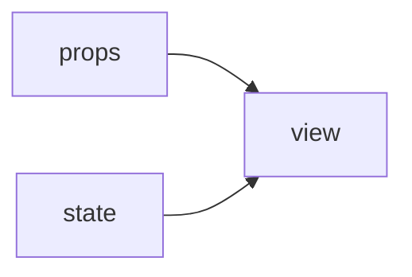
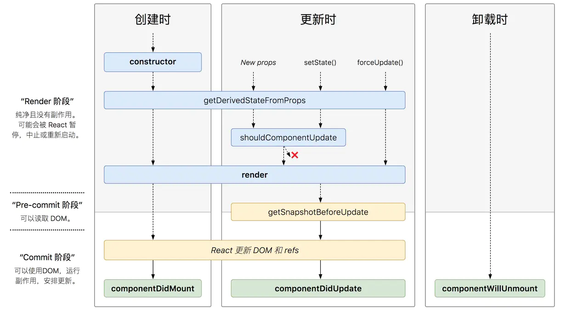

## 一、简介

#### 1. 搭建

**方式一：脚手架**

```shell
npx create-react-app my-app
cd my-app
cnpm start
```

#### 2. 插件工具

- React Developer Tools

  [React Developer Tools - Chrome 扩展下载安装地址](https://chrome.google.com/webstore/detail/react-developer-tools/fmkadmapgofadopljbjfkapdkoienihi?hl=zh-CN)

  图标黑：用react开发，线上版本；

  图标红：用react开发，开发版本；

  图标灰：不是用react开发。

#### 3. 原理

**开发思想**

react 始终整体刷新页面

**数据管理**

单向数据流：父组件可以给子组件传值，但子组件只能使用这个值，不能改变这个值。

**函数式编程**

维护容易；给前端自动化测试带来了很大的便捷性。

**视图层框架--react的定位**

react只帮助解决数据和页面渲染上的问题，组件之间传值交给其他组件完成（redux）。

**声明式开发**

命令式编程：向jQuery这种直接操作DOM的编程方式。一步一步说明怎么做。

声明式开发：react，面向数据编程，只要把数据（图纸）构建好了就可以。react会自动的根据这个数据（图纸）构建网站（大厦）。节约大量DOM操作的代码。

## 二、核心语法

###  JSX 

#### 1.  本质

> `JSX` 仅仅只是 `React.createElement(component, props, ...children)` 函数的语法糖。

不是模板语言，只是一种语法糖。可以在JavaScript代码中直接写HTML标记。

```jsx
//jsx 语法
const element = <hl>Hello{name}</h1>;

//js 语法
const element = React.CreateElement ('h1',null,'Hello',name);
```

> JSX --> createElement -->（虚拟DOM）JS对象 --> 真实DOM

```jsx
render() {
    return (
    	<div>item</div> {/* 不是DOM，而是JSX语法，*/}
    )
    // 实质上是
    return React.createElement("div",{},"item");
}
```


#### 2. 使用

1. 如果要在 JSX 语法内部书写 JS 代码，那么所有的JS代码必须写到 {} 内部；在{}内部，可以写任何符合JS规范的代码；

   + 渲染数字
   + 渲染字符串
   + 渲染布尔值
   + 为属性绑定值
   + 渲染jsx元素
   + 渲染jsx元素数组
   + 将普通字符串数组，转为jsx数组并渲染到页面上【两种方案】

   ```react
   let a = 10;
   const myDiv = <div id='myH1'>
     <h1>这是一个H1{a}</h1>
   </div>;
   ReactDOM.render(myDiv, document.getElementById("app"));
   ```

   当 编译引擎，在编译JSX代码的时候，如果遇到了`<`那么就把它当作 HTML代码去编译，如果遇到了 `{}` 就把 花括号内部的代码当作 普通JS代码去编译；

2. 在JSX中，如果要为元素添加`class`属性了，那么，必须写成`className`，因为 `class`在ES6中是一个关键字；和`class`类似，label标签的 `for` 属性需要替换为 `htmlFor`.

   ```react
   <p className="myele">这是段落</p>
   <label htmlFor="ooo">11111</label>
   ```

3. 在JSX创建DOM的时候，所有的节点，必须有唯一的根元素进行包裹；

   可以使用 `Fragment` 标签：`Fragment `允许你将子列表分组，而无需向 DOM 添加额外节点。[官方文档](https://react.docschina.org/docs/fragments.html)

4. **在 jsx 中 写注释**，注释必须放到 {} 内部：

   ```react
     {/* {arr} */}
     {
       // 这是注释，你看不见我
     }
   ```

#### 3. 约定

**自定义组件以大写字母开头**

1. React认为小写的 `tag` 是原生 `DOM` 节点，如 `div`。
2. 大写字母开头为自定义组件。
3. `JSX` 标记可以直接使用属性语法,例如 `<menu.Item />`。

### CSS 样式

#### 1. 基本使用

css一旦在一个文件中被引用之后，全局生效，即其他组件中对应的样式也生效。这样会造成冲突。**使用 styled-components**  ：组件可以实现样式的独享。避免产生CSS样式冲突的问题。

使用ES6和CSS中最好的部分来设计应用程序的样式。

- [官方文档](https://styled-components.com/)
- [参考文档](https://segmentfault.com/a/1190000014682665)

**全局样式**

使用 `createGlobalStyle` 渲染组件的方式来使用全局样式。其他细节参照上面文档。

```jsx
//style.js
import { createGlobalStyle } from 'styled-components'

export const GlobalStyle =  createGlobalStyle`
    body {
        margin: 0;
        padding: 0;
        font - family: sans - serif;
        background: green;
    }
`;

//index.js
import React from 'react';
import ReactDOM from 'react-dom';
import { GlobalStyle } from './style.js';
import App from './App';

ReactDOM.render(
  <React.StrictMode>
    <GlobalStyle />
    <App />
  </React.StrictMode>,
  document.getElementById('root')
);
```

**举例说明：**

```jsx
<SearchWrapper>
	<span className={focused ? 'focused iconfont zoom' : 'iconfont zoom'}>&#xe682;</span>
</SearchWrapper>


//搜索框
export const SearchWrapper = styled.div`
	position: relative; 
	float: left;
	.zoom {   //表示 SearchWrapper 标签下的 zoom 类；
		position: absolute;
		right: 5px;
		bottom: 5px;
		width: 30px;
		line-height: 30px;
		border-radius: 15px;
		text-align: center;
		&.focused {  ////表示 SearchWrapper 标签下的同时类名有zoom和focused；
			background: #777;
			color: #fff;
		}
	}
`;
```

#### 2. 动画处理

安装 `react-transition-group`

[官方文档](https://reactcommunity.org/react-transition-group/css-transition)

CSSTransition 会自动帮我们做class名字的增加和移除操作。

```jsx
render() {
    return (
        <Fragment>
            <div className={this.state.show ? 'show' : 'hide'}>hello</div>
            <button onClick={this.handleToggle}>toggle</button>
        </Fragment >
    )
}
```

**添加单个动画效果**

```jsx
<CSSTransition in={this.state.show} timeout={1000} classNames='fade' unmountOnExit>
    <div>hello</div>
</CSSTransition>


in //CSSTransition 会自动的往其包含的标签中添加样式，in 表示什么时候应该添加样式。
    //如上：show的值改变时增加样式。true->false 增加出场动画样式；false -> true 增加入场动画样式。

fade-enter //入场动画执行的第一个时刻。CSSTransition 会往内部的div标签上新增加一个属性:fade-enter
fade-enter-active //这个属性在入场动画执行中，会一直存在于内部的div上。
fade-enter-done //入场动画结束之后

fade-exit //出场动画执行的第一个时刻
fade-exit-active //这个属性在出场动画执行中，会一直存在于内部的div上。
fade-exit-done //出场动画结束之后

unmountOnExit //
onEntered //当入场动画结束以后，onEntered钩子会执行。传入一个函数，函数的参数是CSSTransition标签内部的元素
appear={true} // 第一次展示在页面上时，也需要动画效果. 同时在css中添加样式fade-appear, fade-appear-active, fade-appear-done
```

**添加多个动画效果**

使用  <TransitionGroup > 标签，其中单个元素同样需要用 <CSSTransition> 但标签中不需要 in 属性了

```jsx
render() {
    return (
      <Fragment>
        <TransitionGroup>
          {
            this.state.list.map((item, index) => {
              return (
                <CSSTransition
                  timeout={1000}
                  classNames='fade'
                  unmountOnExit
                  onEntered={(el) => { el.style.color = 'blue' }}
                  appear={true}
                  key={index}
                >
                  <div>{item}</div>
                </CSSTransition>
              )
            })
          }
        </TransitionGroup>
        <button onClick={this.handleAddItem}>toggle</button>
      </Fragment >
    )
  }
```

#### 3. 引入外部资源

**引入图片**

如果在样式中引入图片，应该以模块的形式导入图片。

```js
import {
  HeaderWrapper,
  Logo
} from './style'
class Header extends Component {
  render() {
    return (
      <HeaderWrapper>
        <Logo/>
      </HeaderWrapper>
    )
  }
}

// style.js
import styled from 'styled-components'
import logoPic from '../../statics/logo.png';
export const HeaderWrapper = styled.div`
  height:56px;
  border-bottom:1px solid #f0f0f0;
`
export const Logo = styled.a.attrs({
  href: '/'
})`
  position:absolute;
  top:0;
  left:0;
  display:block;
  width:100px;
  height:56px;
  background:url(${logoPic});
  background-size:contain;
`
```

**引入iconfont**

将 iconfont.css 中的样式变为全局样式 ==》 iconfont.js

```jsx
// statics --> iconfont --> iconfont.js
import { createGlobalStyle } from 'styled-components'
export const IconfontStyle = createGlobalStyle`
@font-face {
    font-family: "iconfont";
    src: url('./iconfont.eot?t=1591317989750'); /* IE9 */
    src: url('./iconfont.eot?t=1591317989750#iefix') format('embedded-opentype'), /* IE6-IE8 */
    url('data:application/x-font-woff2;charset=utf-8;base64,d09GMgABAAAAAASYAAsAAAAACNgAAARJAAEAAAAAAAAAAAAAAAAAAAAAAAAAAAAAHEIGVgCDMgqEXIQdATYCJAMUCwwABCAFhG0HYxvEB1GULkqN7EtMRUa6KwlQECEgwAoCcIzh9Yivgm1TVvM34n+rUG7cYcTDP2v/+31GLsNcVLSrRDyRTDRBImnUzuo0vQ+TbzI5l4Vhf+rdOEOEtJ/0U8pfmo4s6004tGwEktrU7BrBBlBQ/z+bhU69x/aBdfkCZim63pqJEBWZL6Wp//+9019bA5vXngWS6lrb+t6nToDRBApob6AsGpMLKFFuGLuJPMj9BEqd5BNndPaPC1EyYFgg1hMdClEJi6wCHwqhUjA3EyfliuRQ8oAT3vfjo2FRkMhTYOyslR0BoblmHenO/7OMYqTDuaAsIsUAgozYUOhZTw4yA8hK63dhphCUComkNqpW7Tr+h63YkK6Ef3gkQiojKoCmgUCbks2oiREJtRBBbURKHbIHo8kFXSnkHhBVntbDlcj4tZIv27QpipbV5g0G1V81fPM9VVtDuwJrfo74VNXTsUcugOP8reCx64/xqmrmLXeWX6P+tQ0MzOGzIOcilgtiApR0X+hsjQBztU0IXMQeoYzysQI8j7KFU2WYwxMCr/tAO8ceeRbgLZO3X5M3X+NXHxPXn1OB1eWDZXnf31NRp4mrj/GbLzMwaM5DwCxIS237NJquW86bqr4df0ObmSb1eZHH3Gw61eV30/m31UAP9/Fn7+v3riH1thD70h9isD5iK570WPtqgJFolds2ibxU72456k51vd0y9qUvtIotmeDMA2HDN/F4zufZM14R4V+dfmNYDU1A7NRUq+/se5LLt6sHRz61kOZMEnykz73Z7G9FcMFhbMu/4zK+ZyQZvrPwsMNmHLfX7+blvC/6dHi6kG8mzW/x30ldUnXaddjtoMRsruhN0rxJSEwzwExtRPcrpRLQbxqWPfAfzt5nmrmYwD+wLFgpkl45741WaHmchebPLNuPLeHj93yTkOr1A3F79NqndXDTCLuBMJA+S4txtqlQ+cvX/jnykUrbrBDovrAG9EvHJzf5X/pYTrJmSpekdCZ/Rz9jhj38im5s8WtU9alUvfDgrRf6P9WZZhrhFWs1lv4L0oYlmS0H1jwzi7HE9OZGxywSq6rEHxBo5ncYXcvGhYRCywgS9XSEVKEHKaMNgFzVCKgoTIZSf12Lq5pjZJHVRz/bHIQmziDRyCNINfFIymg/kGvlHyqaRAqlBdF8zapesUaZzhDkKADUdUA06mBk54qPH0W6Z0EWl3vsScRcEgclhcXpfBdyEBtigruil3KOAWbUBp3cYciyKAgxaiCNFwY5D9UWFeGiIxVq1BYU0zEIxCEBgGodQGgoB6aVOSXz+VGIzmOBWAWhJTgJYVykdaBEoeIGpC6N04hwKZ1dK3SlOA6LgzCGsgGdvAuxYIYCQsW9DIiGKxTskAqpVSSUw001hdPr7HvcBCWwSR5JpJFFHhVNN3rQ2QgS0pJSZe1LpKnQj6GjB6BBJHnBFN8s5Ljrng2pSgQBAAAA') format('woff2'),
    url('./iconfont.woff?t=1591317989750') format('woff'),
    url('./iconfont.ttf?t=1591317989750') format('truetype'), /* chrome, firefox, opera, Safari, Android, iOS 4.2+ */
    url('./iconfont.svg?t=1591317989750#iconfont') format('svg'); /
}

.iconfont {
    font-family: "iconfont" !important;
    font-size: 16px;
    font-style: normal;
    -webkit-font-smoothing: antialiased;
    -moz-osx-font-smoothing: grayscale;
}
`;

//index.js
import React from 'react';
import ReactDOM from 'react-dom';
import App from './App';
import { GlobalStyle } from './style.js';
import { IconfontStyle } from './statics/iconfont/iconfont';

ReactDOM.render(
  <React.StrictMode>
    <GlobalStyle />
    <IconfontStyle /> //这里全局引入。
    <App />
  </React.StrictMode>,
  document.getElementById('root')
);
```


### 组件

#### 1. 理解组件

react 中以组件的方式考虑UI的构建。将UI 组织成组件树的形式。



由属性和状态最终得到一个view。一个组件有两种状态，一个是外部传进来的属性（props），一种是内部维护的状态(state)。

1. React组件一般不提供方法,而是某种状态机
2. React组件可以理解为一个纯函数
3. 单向数据绑定：外部一定是通过props传进来参数，view内部暴露事件通知外部内部状态发生变化。

**组件的类型**

受控组件和非受控组件

受控组件：表单元素由使用者维护，value的取值，取决于外面给它的属性，而不是用户的输入。

```jsx
<input type-"text" value={this.state.value} 
    onChange={event => </input>this.setState({value:event.target.value}) />
```

非受控组件：表单元素状态DOM自身维护。

```jsx
<input type="text" ref={node => this.input=node }/>
```

**何时创建组件：单一职责原则**

1. 每个组件只做一件事。

2. 如果组件变得复杂,那么应该拆分成小组件。

**数据状态管理：DRY原则**

> Don’t Repeat Yourself 不要做重复的状态保存

1. 能计算得到的状态就不要单独存储
2. 组件尽量无状态,所需数据通过props获取。（无状态组件）


#### 2. 创建组件的方式

> 有状态组件和无状态组件之间的本质区别就是：有无state属性！

**1. 使用构造函数来创建组件——无状态组件**

> 函数组件/ 展示组件。性能相对好点。

```jsx
//创建组件 Hello
function Hello(props) {
  return <div>这是 Hello 组件--{props.name}--{props.age}</div>
}
```

- 如果要接收外界传递的数据，需要在构造函数的参数列表中使用`props`来接收；必须要向外return一个合法的 JSX 创建的虚拟DOM。
- 如果在一个组件中 return 一个 null。则表示此组件是空的，什么都不会渲染。在组件中，必须返回一个 合法的 JSX 虚拟DOM元素。且return 的虚拟DOM元素最终会替换`<Hello>`组件。组件名称首字母必须是大写。

**2. 使用class关键字创建组件——有状态组件**

> 类组件 / 容器组件。

```jsx
class Movie extends React.Component {
  constructor() {
    super();
    this.state = {
      msg: '大家好，我是 class 创建的 Movie组件'
    }
  }

  render() {
      //当前组件对应的DOM元素
    return (
        <div>
          这是 Movie 组件 -- {this.props.name} -- {this.props.age}
          {/*<h3>{this.state.msg}</h3>*/}
        </div>
	)
  }
}

const user = {
  name: '大黄',
  age: 3,
};
const myDiv = <div id='myH1'>
  <Movie {...user}/>
</div>;
ReactDOM.render(myDiv, document.getElementById("app"));
```

- render 函数的作用：渲染当前组件所对应的虚拟DOM元素。在 class 关键字创建的组件中，如果想使用 外界传递过来的 props 参数，不需接收，直接通过 `this.props.xxx` 访问即可。不论是 class 还是普通 function 创建的组件，它们的 props 都是只读的。

- 在构造器中定义组件的私有数据：`this.state={}`。在构造器中必须调用 super()，只有调用了 super() 以后，才能使用 this 关键字。

#### 3. 组件内部状态管理

**state**

react是由数据驱动的框架。组件数据的变化会引发页面的自动刷新。

强调：不要直接操作DOM，要操作数据。`react` 会自动感知数据的变化，自动帮使用者生成`DOM`。所以我们在使用react时，不需要关注`DOM`层的操作，只需要关注数据层的操作。比如：在`todolist`应用中，要让`input`框中的内容随输入发生变化，不是操作DOM，而是去操作数据。

`immutable` 特性: state 不允许我们做任何的改变。要修改state中的数据，应该先将其赋值给一个变量。react 数据的修改必须通过 `this.setState({})`。


**this.setState()的用法。**

1. 传入一个对象。

2. 传入函数：this.setState(func1(),func2())

   ```jsx
   //第一个函数参数中的 preState 是指修改数据前的那次数据。
   //第二个函数是设置完 state 后的回调函数
   this.setState((prevState) => ({
       list: [...prevState.list, prevState.inputValue],
       inputValue: ''
   }), () => {
   	console.log(this.ul.querySelectorAll('div').length);
   })
   ```

只有调用 setState() 时，数据才发生变化，虚拟DOM才会去比对。

setState()是异步的，为了提升react底层的性能，原因：如果连续调用**三次**setState()，这三次调用setState()的时间间隔很小，react可以把三次setState() 合并成一个setState()，做**一次**虚拟DOM的比对，然后更新DOM。


**props，state与render函数的关系**

数据发生变化，页面就会跟着变。页面跟着数据发生联动。

原因：页面是由render()函数渲染出来的。当组件的state或者props 发生改变的时候，render 函数就会重新执行。

当父组件的render函数被运行时，它的子组件的render 都将被重新运行一次。


#### 4. 组件通信

**父组件给子组件传值**

父组件通过标签上属性的形式传递；子组件通过`this.props`接收。

```jsx
//父组件：TodoList.js
return (<TodoItem content={item}/>)

//子组件：TodoItem.js
render() {
    const { content } = this.props;
    return (<div>{content}</div>)
}
```

子组件操作父组件的数据

父组件给子组件传递方法（它的this指向要做一次绑定）；子组件调用父组件传来的方法修改父组件的数据。其实数据最终还是父组件的方法改变的。（面试考点）

```jsx
//TodoList.js
this.handleItemDelete = this.handleItemDelete.bind(this);
//
return this.state.list.map((item, index) => {
    return (
        <TodoItem key={index} content={item} index={index} deleteItem={this.handleItemDelete} />
    )
})
//
handleItemDelete(index) {
	this.setState((prevState) => {
        const list = [...prevState.list];
        list.splice(index, 1);
        return { list }
    })
}

//TodoItem.js
return (
    <div onClick={this.handleClick}>
        {content}
    </div>
)
//
handleClick() {
    const { deleteItem, index } = this.props;
    deleteItem(index);

    // this.props.deleteItem(this.props.index);
    // 这里的 this.props.deleteItem() 等价于 this.handleItemDelete()。而这里this指向子组件，子组件中没有handleItemDelete()方法。
    // 子组件调用父组件的方法修改父组件的数据时，需要在给子组件传的方法中指定this。指定的this 就是 上面的 this。
}
```

#### 5. propTypes 值校验

[官方文档](https://react.docschina.org/docs/typechecking-with-proptypes.html)

**propTypes**

如果子组件中需要的数据父组件没传，即使子组件中对该数据做了类型校验，也不会对该数据做检测。

`isRequired:` 父组件必须传该数据。

**defaultProps**

如果父组件没给子组件传值，则使用默认值。

```jsx
TodoItem.propTypes = { //注意这个propTypes p 是小写。
  content: PropTypes.oneOfType([PropTypes.number, PropTypes.string]),
  deleteItem: PropTypes.func,
  index: PropTypes.number
}
```

### 组件的生命周期



生命周期函数指在某一个时刻组件自动调用执行的函数。如render()函数。

**React组件生命周期分为三部分：**

#### 1. 组件挂载

> 特点：一辈子只执行一次

**constructor**

在组件被创建的时候自动调用，是ES6中的特性，一般不把他归类到react的生命周期函数中。

1. 用于初始化内部状态,很少使用
2. 唯一可以直接修改state的地方

**getDerivedStateFromProps**

1. 当state需要从props初始化时使用使用场景
2. 尽量不要使用:维护两者状态一致性会增加复杂度
3. 每次render都会调用
4. 典型场景:表单控件获取默认值

**componentDidMount** 

组件被挂载到页面之后，自动被执行。

1. UI渲染完成后调用
2. 只执行一次
3. 典型场景：获取外部资源。操作DOM节点。

#### 2. 组件更新

props 和 state 发生改变会导致组件更新。

**shouldComponentUpdate** （组件需要更新吗？）

组件被更新之前会自动被执行。返回一个布尔值。

1. 决定Virtual DOM是否要重绘

2. 一般可以由PureComponent自动实现

   PureComponent：用来帮助我们判断之前的props/state 和现在 props/state 是否有变化，如果没变化，会自动组织react 重新更新。

3. 典型场景：性能优化

**getSnapshotBeforeUpdate**

1. 在页面render之前调用, state已更新
2. 典型场景:获取render之前的DOM状态

**componentDidUpdate** 

1. 每次UI更新时被调用
2. 典型场景:页面需要根据props变化重新获取数据


 一个组件要从父组件接受参数；只要父组件的render 函数被重新执行了，子组件的这个生命周期函数就会被执行。（如果这个组件第一次存在于父组件中不会执行，如果这个组件之前已经存在于父组件中，这个生命周期函数才会执行。）

#### 3. 组件销毁

**componentWillUnmount**

当这个组件即将被从页面中剔除的时候，会被执行。


#### 使用场景

1. react的 component 组件里面内置了其他生命周期函数的默认实现（除了render外），所以一个组件里面必须写render() 函数。

2. 父组件数据更新时，不让子组件也跟着刷新。

```jsx
shouldComponentUpdate(nextProps, nextState) {
    if (nextProps.content !== this.props.content) {
        return true;
    } else {
        return false;
    }
}
```

3. 性能优化的点
   - 把函数作用域的修改放到constructor里面，这样函数作用域的绑定只会执行一次，而且可以避免子组件的无故渲染。

   - `setState()`  可以把多次数据的改变结合成一次来做，降低虚拟DOM的比对频率。

   - 虚拟DOM同层比对，key值

   - shouldComponentUpdate() 避免组件无故render()函数的运行。


4. 发 ajax请求：在componentDidMout()生命周期函数中发ajax请求。

### ref

ref 帮助我们在react中直接获取Dom元素。一般情况下尽量不要使用ref。react建议我们用数据驱动的方式编写代码，尽量不要直接操作DOM。

有时候ref与 setState 合用时会出现一些坑：获取DOM元素不及时，原因是setState是异步的。如果要页面更新之后获取DOM元素，一定要在setState的回调函数里面。

[官方文档](https://react.docschina.org/docs/forwarding-refs.html)


### 原理

#### 1. 虚拟DOM

**真实DOM和虚拟DOM的区别**：

 + DOM的本质是什么：浏览器中的概念，用 JS 对象来表示页面上的元素，并提供了操作DOM对象的API。
 + 什么是React中的虚拟DOM：框架中的概念，本质是程序员用JS对象来模拟页面上的DOM和DOM嵌套。虚拟DOM是以 JS 对象的形式存在的。

**没有虚拟DOM的情况下：**

浏览器向服务器请求数据回来的；把这些数据以对象数组的形式存在浏览器的内存中；手动for循环整个数组，在浏览器内存中渲染出一棵DOM树，最终把DOM树呈现到页面上。对于所有未改变的项都是进行重排和重绘，造成浏览器的性能问题。所以在框架中引入虚拟DOM的概念。

**实现虚拟DOM的目的**：为了实现页面中DOM元素的高效更新。

**虚拟DOM：**

获取内存中的新旧两棵DOM，进行对比，得到需要被**按需更新**的DOM元素。

我们无法拿到浏览器内存中的DOM树，需要手动模拟DOM树。

```jsx
//模拟DOM元素
<div id= "mydiv" title='说实话' >
    这是例子
    <p>段落</p>
</div>

let div = {
    tagName: 'div',
    attrs:{
        id: 'mydiv',
        title: '说实话',
        'data-index':'0',
    },
    childrens: [
        'hahhah',
        {
            tagName: 'p',
            attrs:{},
            childrens: [
                "段落"
            ]
        }
	]
}
```

**虚拟DOM的优点：**

1. 性能提升：DOM对象的比对换成了JS对象的比对。
2. 它使得跨端应用得以实现：Android 和 iOS中不存在DOM，在浏览器端，可以把虚拟DOM转换成真实DOM；在原生应用中，虚拟DOM转换成原生应用组件。使得react 既能开发网页应用，也能开发原生应用。

#### 2. Diff算法

`diff` 算法用来比较两棵 `Virtual DOM` 树的差异，如果需要两棵树的完全比较，那么 `diff` 算法的时间复杂度为`O(n^3)`。但是在前端当中，你很少会跨越层级地移动 `DOM` 元素，所以 **`Virtual DOM` 只会对同一个层级的元素进行对比**， `div` 只会和同一层级的 `div` 对比，第二层级的只会跟第二层级对比，这样算法复杂度就可以达到 `O(n)`。


对虚拟DOM树从上至下比对，当同一层级的虚拟DOM节点不一致时，react就不会再往下比对了，对原始DOM做替换。虽然下面的子节点可能一致，可能造成DOM节点渲染的浪费，但是算法复杂度是O(n)，速度提升。

**tree diff:**

新旧两棵DOM树逐层对比的方式，就叫做 tree diff。把整棵DOM树逐层对比完后，必然能够找到那些需要被更新的元素。

**component diff：**

在对比每一层的时候，组件之间的对比，叫做 component diff。当对比组件的时候，如果两个组件的类型相同，则暂时认为这个组件不需要被更新，如果组件的类型不同则立即将旧组件移除，新建一个组件替换到被移除的位置。

**element diff:**

在组件中每个元素之间也要进行对比，那么元素级别的对比叫做 element diff。

**key：**

key这个属性，可以把 页面上的 DOM节点 和 虚拟DOM中的对象，做一层关联关系。

**在做列表循环的时候为什么要引入key值。**

假如在做虚拟DOM节点循环的时候，虚拟DOM的比对会根据key值做关联。不要用index 做key值的原因是，无法保证在原始的虚拟DOM树上的key值和新的虚拟DOM树上的key值一致。


## 三、redux

### 简介

是一个 JS 状态管理框架。全局只有一个store，这个store维护所有组件的状态。

redux 就是一个数据层的框架。

#### 1. 设计初衷

随着JavaScript单页面发开日趋复杂，JavaScript 需要管理更多的state (状态)，这些state可能包括服务器响应、缓存数据、本地生成未持久化到服务器的数据，也包括UI状态等。

管理不断变化的 `state` 非常麻烦，如果一个 `model` 的变化会引起另一个 `model` 变化，那么当 `view` 变化时，就可能弓|起对应 `model` 以及另一个 `model` 的变化，依次可能会引起另一个 `view` 的变化。所以就会产生混乱，而Redux就是为了去解决这个问题。


#### 2. Redux 三大核心

**1. 单一数据源**

整个应用的 `state`被存储在一颗 `object tree` 中，并且这个 `object tree` 只存在于唯一个 `store`中。


**2. state是只读的**

唯一改变`state`的方法就是触发`action`, `action` 是一个用于描述已发生事件的普通对象。

这样确保了视图和网络请求都不能直接去修改state,相反，它们只能表达想要修改的意图，因为所有的修改都被集中化处理，并且严格按照一个接- 个的顺序执行。

```jsx
//触发action
store.dispatch({type: 'COMPLETE_TODO'，index: 1})
```

**3. 使用纯函数来执行修改**

> 纯函数是指：给定固定的输入，就一定会与固定的输出，而且不会有任何副作用。

为了描述`action`如何改变`state tree`，你需要去编写`reducers`。Reducers只是一些纯函数，它接收先前的state和action,并且返回新的state。可以复用、可以控制顺序、传入附加参数。


#### 3. Redux 组成部分


**1. State - 状态**

就是我们传递的**数据**，在用React开发项目的时候，大致可以把State分为三类：

- **DomainDate**:：可以理解成为服务器端的数据，比如:获取用户的信息，商品的列表等。
- **UI State**：决定当前UI决定展示的状态，比如:弹框的显示隐藏，受控组件等。
- **App State**： App级别（全局）的状态，比如:当前是否请求loading, 当前路由信息等可能被多个和组件去使用的到的状态。

**2. Action - 事件**

Action是把数据从应用传到 `store` 的**载体**，它是`store`数据的唯一来源。

一般来说， 我们可以通过`store.dispatch `将 `action` 传递给 `store`。


Action特点:

- Action 的本质就是一个javaScript的普通对象
- Action 对象内部必须要有一个`type`属性来表示要执行的动作
- 多数情况下， 这个`type`会被定义成字符串常量
- 除了`type`字段之外，action的结构随意进行定义
- 而我们在项目中，更多的喜欢用action创建函数(就是创建action的地方)
- **只是描述了有事情要发生，并没有描述如何去更新state**

```jsx
//action
{
	type: '字符串常量',
	info: {...},
	isLoading: true
	...
}
    
//action 创建函数
function addAction(params){
    //返回一个action对象
    return {
    	type: 'add',
        ...params
    }
}
```

**3. Reducer**

Reducer本质就是一个**函数**, 它用来响应发送过来的 `actions` ,然后经过处理，把 `state` 发送给 `Store` 的 。（相当于一个中转站）
注意:在Reducer函数中，需要**return返回值**，这样Store才能接收到数据；函数会接收两个参数，第一个参数是初始化state,第二个参数是action

```jsx
const initState = {...};
rootReducer = (state = initState, action) => { ... return {...}} ;
```


**4. Store**

Store就是把action与reducer联系到一起的对象。

**主要职责:** 

- 维持应用的state
- 提供 store.getState()：获取到store中所有的数据内容。
- 提供 store.dispatch()：派发action
- 通过 store.subscribe()：订阅store的改变，只有store发生改变，此函数接收的回调函数就会被执行。

```jsx
import { createStore} from "redux";
const store = createStore(传递reducer);
```

#### 4. 调试工具

[redux-devtools-extension](https://github.com/zalmoxisus/redux-devtools-extension)

**使用**

```js
//store --> index.js
import { createStore } from 'redux'
import reducer from './reducer'
const store = createStore(reducer, window.__REDUX_DEVTOOLS_EXTENSION__ && window.__REDUX_DEVTOOLS_EXTENSION__())

export default store;
```

表示：如果安装了这个插件，就执行这个插件。实际上它是一个redux的中间件。

### 代码结构

创建 actionTypes.js 文件：把所有action 中的 type 都定义为一个常量放到一个文件中。这样做出错了好找出错的地方。

```jsx
//actionTypes.js
export const CHANGE_INPUT_VALUE = 'change_input_value';
export const ADD_TODO_ITEM = 'add_todo_item';
export const DELETE_TODO_ITEM = 'delete_todo_item';

//reducer.js
import { CHANGE_INPUT_VALUE, ADD_TODO_ITEM, DELETE_TODO_ITEM } from './actionTypes'
const defaultState = {...}
export default (state = defaultState, action) => {
  if (action.type === CHANGE_INPUT_VALUE) {
	...
  }
  ...
}
```

使用 actionCreator来统一管理页面上的所有action。维护起来比较方便，自动化测试方便。

```js
import { CHANGE_INPUT_VALUE, ADD_TODO_ITEM, DELETE_TODO_ITEM } from './actionTypes'

export const getInputChangeAction = (value) => ({
  type: CHANGE_INPUT_VALUE,
  value
});
export const getAddItemAction = () => ({
  type: ADD_TODO_ITEM
});
export const getDeleteItemAction = (index) => ({
  type: DELETE_TODO_ITEM,
  index
});
```

### react-redux

#### 1. react-redux 概述

**Redux与React的关系**

Redux与React之间是没有关系的，Redux 支持React. Angular. jQuery 甚至是JavaScript。

Redux与React这类库搭配起来更好用。

**React-redux**

`react-redux `就是Redux官方出的用于配合React的绑定库。

`react-redux` 能够使你的React组件从`Redux store`中很方便的读取数据，并且向 `store` 中分发`actions` 以此来更新数据。

#### 2. React-Redux中两个重要的成员

在学习React的时候，我们了解到，React 这个UI的框架是**以组件来进行驱动**的，所以react-redux中有两个重要的部分，先来认识一下：

- Provider：这个组件能够使你整个app都能获取到store中的数据。

- connect：这个方法能够使组件跟store来进行关联。

在组件内部，要想获取到provider帮我们维护的store，我们必须通过connect 方法来进行一层加强。

**Provider组件**

> Provider组件:用于包裹整个结构，让我们组件能够获取到store

Provider **包裹**在根组件最外层，使所有的子组件都可以拿到State。

Provider 接收 **store** 作为 **props**，然后通过 **context** 往下传递，这样react中任何组件都可以通过context获取到store。

context 是维护 在组件内部的，在使用的时候并看不到它。


**connect 方法**

>  如果我们需要接收Provider 提供的 store，就需要把组件通过 connect 加强。

Provider 内部组件如果想要使用到state中的数据，就必须要`connect`进行一层包裹封装, 换一句话来说就是必须要被`connect`进行加强。connect就是方便我们组件能够获取到`store`中的`state`。

```jsx
//TodoList.js
import { connect } from 'react-redux'

function TodoList(props) {
  const { inputValue, list, changeInputValue } = props;
  return (
      <div>
        <input value={inputValue} onChange={changeInputValue} />
      </div>
  )
}

const mapStateToProps = (state) => {
  return {
    inputValue: state.inputValue,
  }
}

const mapDispatchToProps = (dispatch) => {
  return {
    changeInputValue(e) {
      const action = {
        type: 'change_input_value',
        value: e.target.value
      }
      dispatch(action);
    }
  }
}

export default connect(mapStateToProps, mapDispatchToProps)(TodoList)
// 让 TodoList 和 store 做关联，连接的映射规则在 mapStateToProps中。store中的state会映射到组件的props中。
// mapDispatchToProps:把store的dispatch() 挂载到 props 上。能够让props中的方法调用dispatch去操作store中的数据
```


### redux中间件

中间件：就是一种独立运行于各个框架之间的代码，本质就是一个函数。

中间件是运行在action发送出去，到达reducer之间的一段代码，就可以把代码调用流程变为 **action -> Middlewares -> reducer**，这种机制可以让我们改变数据流，实现例如异步action，action过滤，日志输入，异常报告等功能。常用的有 redux-thunk(把异步放到action中)、redux-saga（把异步操作单独的放到一个文件里）。

**redux-middleware**

1. 截获action
2. 发出action

异步action不是特殊action,而是多个同步action的组合使用

> view发出去的一个action，其实是标准的action，但是到了中间件这一层，它会做一个特殊的处理，然后再去dispatcher不同的action出去，这些不同的action其实还是同步的action，只不过异步action是把这些同步action的dispatch分成了不同的阶段，从整体上来看我们完成了一次异步action的操作

中间件在dispatcher中截获action做特殊处理

> 截获某种特殊类型的action，当截获到以后不是dispatcher到一个reducer，而是去访问一个API。如果API返回结果成功，他就发一个成功的action出去。所以一个ajax请求action到中间件之后，他会进行一个预处理，处理完之后，它才会把结果的action，dispatch给reducer来更新store。这样完成一个ajax请求。

`Redux` 提供了一个叫 `applyMiddleware` 的方法，可以应用多个中间件。

#### 1. redux-thunk

遇到异步请求或者非常复杂的逻辑，我们希望把他们移到统一的地方进行管理。

redux-thunk 可以把这些放到action中处理。它是redux的中间件，不是react的中间件。同时，使用redux-thunk有利于自动化测试。

```shell
cnpm install redux-thunk --save
```

```js
//   store/index.js
import { createStore, applyMiddleware, compose } from 'redux'
import reducer from './reducer'
import thunk from 'redux-thunk'
const composeEnhancers = window.__REDUX_DEVTOOLS_EXTENSION_COMPOSE__ ? window.__REDUX_DEVTOOLS_EXTENSION_COMPOSE__({}) : compose;
const enhancer = composeEnhancers(
  applyMiddleware(thunk),
);

const store = createStore(reducer, enhancer)

export default store;
```

当使用了redux-thunk 之后，action 可以是一个函数了（之前是对象）

```jsx
//actionCreators.js
export const getInitListAction = (data) => ({
  type: INIT_LIST_ACTION,
  data
});
export const getTodoList = () => {
  return (dispatch) => {
    axios.get("http://localhost:3001/api/list").then((res) => {
      const data = res.data.data;
      const action = getInitListAction(data);
      dispatch(action) //真正的送到reducer中处理
    })
  }
};

//TodoList.js
import { getTodoList, getInputChangeAction, getAddItemAction, getDeleteItemAction } from './store/actionCreators'

  componentDidMount() {
    const action = getTodoList();
    store.dispatch(action)  //action 可以是一个函数。
  }
```


#### 2. redux-saga

redux-saga 也是做异步代码拆分的中间件。可以用 redux-saga 完全代替 redux-thunk

- `redux-saga` 是一个用于管理应用程序 `Side Effect` 副作用（例如：异步操作等）的 `library`，它的目的是让 副作用 管理更加的简单，执行更高效

- `redux-saga` 就是 `redux` 的一个中间件，可以通过正常的 `redux action` 从主应用程序启动，暂停和取消，它可以访问完整的 `redux state`，也能够 `dispatch redux action`

- `redux-saga` 使用了 `ES6`的`Generator`功能，让异步流程更加易于读取、写入和测试，通过这种方式，让异步看起来更加像标准同步的`Javascript`代码（有点像 `async/await`）

**Redux-Saga 常见API介绍**

<table style="font-size:12px">
    <tr>
      <th style="width: 180px;">类型</th>
      <th style="width: 220px;">API</th>
      <th>说明</th>
    <tr>
      <td rowspan="2" >Middleware API</td>
      <td>createSagaMiddleware(options)</td>
      <td>创建一个 Redux middleware，并将 Sagas 连接到 Redux Store</td>
    </tr>
    <tr>
      <td>middleware.run(saga, ...args)</td>
      <td>动态地运行 saga。只能用于在 applyMiddleware 阶段之后执行 Saga</td>
    </tr>
    <tr>
      <td rowspan="4">Saga 辅助函数</td>
      <td>takeEvery(pattern, saga, ...args)</td>
      <td>在发起（dispatch）到 Store 并且匹配 pattern 的每一个 action 上派生一个 saga</td>
    </tr>
    <tr>
      <td>takeLatest(pattern, saga, ..args)</td>
      <td>在发起到 Store 并且匹配 pattern 的每一个 action 上派生一个 saga。并自动取消之前所有已经启动但仍在执行中的 saga 任务</td>
    </tr>
    <tr>
        <td>takeLeading(pattern, saga, ..args)</td>
        <td>在发起到 Store 并且匹配 pattern 的每一个 action 上派生一个 saga。 它将在派生一次任务之后阻塞，直到派生的 saga 完成，然后又再次开始监听指定的 pattern。</td>
    </tr>
    <tr>
      <td>throttle(ms, pattern, saga, ..args)</td>
       <td>在发起到 Store 并且匹配 pattern 的一个 action 上派生一个 saga。 它在派生一次任务之后，仍然将新传入的 action 接收到底层的 buffer 中，至多保留（最近的）一个。但与此同时，它在 ms 毫秒内将暂停派生新的任务 —— 这也就是它被命名为节流阀（throttle）的原因</td>
    </tr>
    <tr>
      <td rowspan="8">Effect 创建器</td>
      <td>take(pattern)</td>
        <td>阻塞的方法，用来匹配发出的action</td>
    </tr>
    <tr>
      <td>put(action)</td>
      <td>用来命令 middleware 向 Store 发起一个 action。 这个 effect 是非阻塞型的</td>
    </tr>
    <tr>
       <td>put.resolve(action)</td>
       <td>类似 put，但 effect 是阻塞型的（如果从 dispatch 返回了 promise，它将会等待其结果）</td>
    </tr>
    <tr>
      <td>call(fn, ...args)</td>
      <td>创建一个 Effect 描述信息，用来命令 middleware 以参数 args 调用函数 fn</td>
    </tr>
    <tr>
      <td>fork(fn, ...args)</td>
        <td>创建一个 Effect 描述信息，用来命令 middleware 以 非阻塞调用 的形式执行 fn</td>
    </tr>
    <tr>
      <td>join(task)</td>
        <td>创建一个 Effect 描述信息，用来命令 middleware 等待之前的一个分叉任务的结果</td>
    </tr>
    <tr>
       <td>cancel(task)</td>
        <td>创建一个 Effect 描述信息，用来命令 middleware 取消之前的一个分叉任务,如果不带参数，就是自取消的意思</td>
    </tr>
    <tr>
      <td>select(selector, ...args)</td>
        <td>获取redux中的state，如果调用 select 的参数为空（即 yield select()），那么 effect 会取得完整的 state（与调用 getState() 的结果相同）</td>
    </tr>
    <tr>
      <td rowspan="2">Effect 组合器(combinators)</td>
        <td>race(effects)</td>
        <td>创建一个 Effect 描述信息，用来命令 middleware 在多个 Effect 间运行 竞赛（Race）,其中一个完成了之后，那么另外一个Effect默认被取消
        </td>
    </tr>
    <tr>
      <td>all([...effects])</td>
        <td>创建一个 Effect 描述信息，用来命令 middleware 并行地运行多个 Effect，并等待它们全部完成</td>
    </tr>

**createSagaMiddleware(options)**   

功能：创建一个 `Redux middleware`，并将 Sagas 连接到 `Redux Store`，通过 `createStore` 第三个参数传入

参数：options: 传递给 `middleware`的选项列表，默认可以不用传递

**middleware.run(saga, ...args)**

功能：动态地运行 saga。只能用于在 `applyMiddleware` 阶段 之后 执行 Saga。

参数：

> ​    `saga`:  一个`Generator` 的函数
>
> ​    `args`:  提供给`saga`的参数

**Saga 辅助函数**

> 这三个辅助函数都是用来监听action。只要action发送过来了，就会触发对应的 saga函数的调用。

**takeEvery(pattern, saga, ...args)**

触发了多少次异步的action，就会执行多少次异步的任务

> 在发起（dispatch）到 Store 并且匹配 pattern 的每一个 action 上派生一个 saga
>
> ​    `pattern`： 如果以空参数或 '*' ，那么将匹配所有发起的 action
>
> ​    `saga`： 一个 Generator 函数
>
> ​    `args`： 传递给启动任务的参数

**takeLatest(pattern, saga, ..args)** 

每次触发，会取消掉上一次正在执行的异步任务。类似于防抖

> 在发起到 Store 并且匹配 pattern 的每一个 action 上派生一个 saga。并自动取消之前所有已经启动但仍在执行中的 saga 任务。
>
> ​     参数参照上一个

**throttle(ms, pattern, saga, ..args)**

匹配到一个对应的action后，会执行一个异步任务。类似于节流。

> 在发起到 Store 并且匹配 pattern 的一个 action 上派生一个 saga。 它在派生一次任务之后，仍然将新传入的 action 接收到底层的 buffer 中，至多保留（最近的）一个。但与此同时，它在 ms 毫秒内将暂停派生新的任务 —— 这也就是它被命名为节流阀（throttle）的原因。
>
> ​    `ms`: 节流阀的时间
>
> ​    后面参数参照上面

**`Effect` 创建器**

**select(selector, ...args)**

> 获取`redux`中的`state`，如果调用 `select` 的参为空（即 `yield select()`），那么 `effect` 会取得完整的 `state`（与调用 `getState()` 的结果相同）
>
> ​     `selector`: 选择器

**call(fn,...args)**

> 创建一个`Effect` 描述信息，用来命令 `middleware `以参数 `args` 调用函数 `fn` 。

**take(pattern)**

> 阻塞的方法，用来匹配发出的`action`

**put(action)**

> 用来命令 `middleware` 向 `Store` 发起一个 `action`。 这个 `effect` 是非阻塞型的。


**示例**

```js
// 在store-->index.js中使用redux-saga中间件。
import { createStore, applyMiddleware, compose } from 'redux'
import reducer from './reducer'
import createSagaMiddleware from 'redux-saga'
import todoSages from './sagas'

const sagaMiddleware = createSagaMiddleware();
const composeEnhancers = window.__REDUX_DEVTOOLS_EXTENSION_COMPOSE__ ? window.__REDUX_DEVTOOLS_EXTENSION_COMPOSE__({}) : compose;
const enhancer = composeEnhancers(applyMiddleware(sagaMiddleware));


const store = createStore(reducer, enhancer);
sagaMiddleware(todoSages);

export default store;
```

saga文件的写法必须要求一个函数generator函数。

```js
// sagas.js
import { takeEvery, put } from 'redux-saga/effects'
import { GET_INIT_LIST } from './actionTypes'
import { initListAction } from './actionCreators'
import axios from 'axios'

function* getInitList() {
  try {
    const res = yield axios.get("http://localhost:3001/api/list");
    const action = initListAction(res.data.data);
    yield put(action); //dispatch到 reducer 
  } catch (e) {
    console.log("网络请求失败");
  }
}

function* mySaga() {
  yield takeEvery(GET_INIT_LIST, getInitList) // 匹配type为GET_INIT_LIST的action。
}

//getInitList 可以是一个普通的函数，也可以是一个 generator函数

export default mySaga
```

逻辑：当容器组件加载完成后，会派发一个action 。reducer 和 saga 都能接收到这个action

```js
import { getInitList } from './store/actionCreators'

class TodoList extends React.Component {
  ...
  componentDidMount() {
    const action = getInitList();
    store.dispatch(action);
  }
}
export default TodoList
```

### combineReducers

#### 1. 简介

作用：把多个reducer 组合成一个新的reducer，并且定义每个reducer对应的store的一个节点。

#### 2. 案例

```js
//common-->header-->store-->reducer
const defaultState = {
  focused: false
}

export default (state = defaultState, action) => {
  if (action.type === 'search_focus') {
    return {
      focused: true
    }
  }
  if (action.type === 'search_blur') {
    return {
      focused: false
    }
  }
  return state;
}

//common-->header-->store-->index
import reducer from './reducer';
export { reducer }

//store-->reducer.js
import { combineReducers } from 'redux'
import { reducer as headerReducer } from '../common/header/store'

const reducer = combineReducers({
  header: headerReducer
})

export default reducer

//在Header组件中，使用到对应数据的地方，也需要做更改 state.header.xxx
const mapStateToProps = (state) => {
  return {
    focused: state.header.focused
  }
}
```


## 四、react-router

路由不只是页面切换,更是代码组织方式。

react-router是在一个组件容器中，通过url来判断当前应该显示什么样的组件。

#### React Router的特性

1. 声明式路由定义
2. 动态路由

#### 三种路由实现方式

1. URL 路径
2. hash 路由
3. 内存路由

#### 基于路由配置进行资源组织

1. 实现业务逻辑的松耦合
2. 易于扩展,重构和维护
3. 路由层面实现Lazy Load

#### React Router API

`<Link>` : 普通链接,不会触发浏览器刷新

展现出的效果和在html中使用a标签的效果一样，点击这个链接的时候react-router会接管这个导航，而不是浏览器做页面的切换

```jsx
import { Link } from 'react-router-dom'
<Link to="/about">About</Link>
```

`<NavLink>`：类似Link但是会添加当前选中状态

```jsx
<NavLink to="/faq" activeClassName="selected">FAQs</NavLink>
```

`< Prompt> `：满足条件时提示用户是否离开当前页面

`<Redirect>`：重定向当前页面,例如登录判断

`< Route>` ：路由配置的核心标记,路径匹配时显示对应组件

`<Switch> `：只显示第一个匹配的路由


#### 路由参数的传递

通过URL传递参数

1. 如何通过URL传递参数: < Route path= "/topic/:id" .. />

2. 如何获取参数: this.props.match.params

3. https://github.com/ pillarjs/path-to-regexp

   它可以把一个url的路径转换成一种正则表达式。

   把参数作为url路径的一部分，而不是作为查询字符串==>对搜索引擎更加友好，看上去更加有语义。


#### 嵌套路由的实现

前端特有

1. 每个React组件都可以是路由容器
2. React Router的声明式语法可以方便的定义嵌套路由


## 五、组件库


