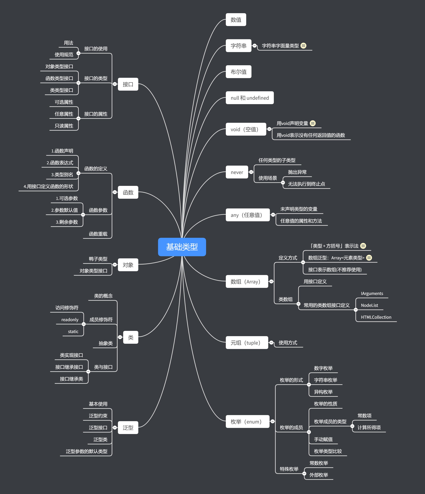

# 简介


[TypeScript](http://www.typescriptlang.org/) 是 JavaScript 的一个超集，主要提供了**类型系统**和**对 ES6 的支持**。

**编译时就知道变量类型的是静态类型；运行时才知道一个变量类型的叫做动态类型**。

### 使用

#### 使用方式一

**Typescript安装**

```shell
cnpm install -g typescript
```

**运行**

```shell
tsc fileName
```

**vscode  自动编译.ts文件** 

1. 使用`tsc --init` 生成配置`tsconfig.json`文件
2. 点击 `终端`—> `运行任务` —> `typescript` —> `tsc:监视-tsconfig.json` 即可自动生成代码。

> 若遇到问题：
>
> tsc : 无法加载文件 C:\Users\pillar\AppData\Roaming\npm\tsc.ps1，因为在此系统上禁止运行脚本。
>
> **解决办法：**
>
> 执行策略的设置问题。默认情况下，执行策略为不允许任何脚本运行，所以会报错。

打开PowerShell，输入set-executionpolicy remotesigned，之后选择Y，问题就解决了。

**注意：**

- TypeScript 只会进行**静态检查**，如果发现有错误，编译的时候就会报错。
- TypeScript 编译的时候即使报错了，还是会生成编译结果。

**示例1：**

> test1.ts

```typescript
function foo(a:number){
    console.log(a);
}
let num = 2;
foo(num);
```

> test1.js

```typescript
function foo(a) {
  console.log(a);
}
var num = 2;
foo(num);
```

TypeScript 中，使用 `:` 指定变量的类型，`:` 的前后有没有空格都可以。

上述例子中，用 `:` 指定 `a` 参数类型为 `number`。编译为 js 之后，类型检查的代码不会被插入到 js 文件中。

TypeScript 只会进行**静态检查**，如果发现有错误，编译的时候就会报错。

**示例2：**

> test2.ts

```typescript
function foo(a:number){
    console.log(a);
}
let s = "string";
foo(s);
```

> test2.js

```typescript
function foo(a) {
    console.log(a);
}
var s = "string";
foo(s);
```

编辑器中会提示错误，编译的时候也会出错：但是还是生成了 js 文件：**TypeScript 编译的时候即使报错了，还是会生成编译结果**，我们仍然可以使用这个编译之后的文件。


#### 使用方式二：webpack

```shell
//配置
cnpm init -y
cnpm install typescript -g
tsc --init
cnpm install webpack webpack-cli webpack-dev-server -D
cnpm install ts-loader typescript -D
cnpm install html-webpack-plugin clean-webpack-plugin webpack-merge -D
```

其余目录结构参考demo1


#### 类型注解

作用：相当于强类型语言中的类型声明。

语法：（变量/函数）：type


### 相关知识

#### 强类型语言和弱类型语言

强类型语言：不能**改变**变量的数据类型，除非进行强制类型转换。Java、c#、Python、C/C++

弱类型语言：能够**改变**变量的数据类型。JavaScript、PHP

#### 静态类型语言和动态类型语言

静态类型语言：在编译阶段**确定**变量的类型。如：java、C#、C/C++、TypeScript

动态类型语言：在执行阶段**确定**变量的类型。如：JavaScript、Python、PHP


# 基础类型



### 数值(number)

双精度 64 位浮点值。它可以用来表示整数和分数。

```typescript
let binaryLiteral: number = 0b1010; // 二进制
let octalLiteral: number = 0o744;    // 八进制
let decLiteral: number = 6;    // 十进制
let hexLiteral: number = 0xf00d;    // 十六进制
```


### 字符串(string)

使用单引号（**`'`**）或双引号（**`"`**）来表示字符串类型。反引号（**`**）来定义模板字符串。

```typescript
let s: string = "pillar";
let state: number = 2;
let words: string = `name is ${s},state is ${state}`;
console.log(words);
```

**字符串字面量类型**

字符串字面量类型用来约束取值只能是某几个字符串中的一个。用`type`来定义。

```typescript
//使用type定义了一个字符串字面量类型 color，它只能取三种字符串中的一种。
type color = 'red' | 'black' | 'yellow';
function foo(myName: string, myColor: color) {
    console.log(`${myName}--${myColor}`);
}
foo("Tom", 'red'); //正确
foo('Bob', 'pink');//Argument of type '"pink"' is not assignable to parameter of type 'color'.
```

**注意**：类型别名与字符串字面量类型都是使用 `type` 进行定义。


### 布尔值(boolean)

```typescript
let isBool: boolean = false;
console.log(isBool);
```

注意，使用构造函数 `Boolean` 创造的对象**不是**布尔值，而是一个Boolean对象。

```typescript
//错误用法
let isBool1:boolean = new Boolean(1);
console.log(isBool1);
//test1.ts:11:5 - error TS2322: Type 'Boolean' is not assignable to type 'boolean'.
```

直接调用 `Boolean` 也可以返回一个 `boolean` 类型：

```typescript
//正确用法
let isBool: boolean = Boolean(1);
console.log(isBool);//true
```


### null和undefined

null 和 undefined 是除never外其他任何类型（包括 void,）的子类型，可以赋值给其它类型，如数字类型，此时，赋值后的类型会变成 null 或 undefined。

而如果在TypeScript中启用严格的空校验（'strictNullChecks':true）特性（推荐使用），就可以使得null 和 undefined 只能被赋值给 void 或本身对应的类型，示例代码如下：

```typescript
// 未启用:'strictNullChecks':false
let x: number;
x = 1;//运行正确
x = undefined;//运行正确
x = null;//运行正确
```

```typescript
// 启用:'strictNullChecks':true
let x: number;
x = 1;//运行正确
x = undefined;//运行错误
x = null;//运行错误
```


### 空值(void)*

TypeScript中新引入的。

用法一：用 `void`声明变量。这种用法**没什么用**，因为只能将它赋值为`undefined`和`null`。

```typescript
let v: void = null;
console.log(v); //null
```

用法二：用 `void` 表示没有任何返回值的函数：

```typescript
function foo(a: number): void {
    console.log(a);
}
foo(2); //2
```


### never*

never 是任何类型（包括 null 和 undefined）的子类型，代表从不会出现的值，可以赋值给任何类型。这意味着声明为 never 类型的变量**只能**被 never 类型所赋值，在函数中它通常表现为**抛出异常**或**无法执行到终止点**（例如无限循环），示例代码如下：

```typescript
let x: never;
let y: number;
let z: null;
x = 123;// 运行错误，数字类型不能转为 never 类型

// 返回值为 never 的函数可以是抛出异常的情况
function error(message: string): never {
    throw new Error(message);
}
y = error('this is error') //OK
z = error('this is error') //OK

// 返回值为 never 的函数可以是无法被执行到的终止点的情况
function loop(): never {
    while (true) {}
}
```


### 任意值(any)*

`any` 类型，允许被赋值为任意类型。任意值允许在编译时可选择地包含或移除类型检查。我们不希望类型检查器对这些值进行检查，可以使用`any`类型来标记这些变量，直接让它们通过编译阶段的检查。

**未声明类型的变量**

变量如果在声明的时候，未指定其类型，那么它会被识别为任意值类型：

```typescript
let x; //等价于：let x: any;
x = "string";
console.log(x);//string
x = 7;
console.log(x);//7
```

**任意值的属性和方法**

在任意值上访问任何属性都是允许的，也允许调用任何方法。

声明一个变量为任意值之后，对它的任何操作，返回的内容的类型都是任意值。

```typescript
let x: any = "string";
console.log(x.name);
console.log(x.name.firstName);
```

与Object比较

`Object`类型的变量只是允许你给它赋任意值 ，但是却不能够在它上面调用任意的方法，即便它真的有这些方法：

```typescript
let notSure: any = 4;
notSure.ifItExists(); // okay, ifItExists might exist at runtime
notSure.toFixed(); // okay, toFixed exists (but the compiler doesn't check)

let prettySure: Object = 4;
prettySure.toFixed(); // Error: Property 'toFixed' doesn't exist on type 'Object'.
```


### 数组(array)

在JavaScript中，数组元素的类型可以任意的，如 `let a = [1, "1", true];`但是在TypeScript中，数组的项中不允许出现其他类型( any[] 类型的数组可以不同)：

```typescript
//错误代码
let arr: Array<number> = [1, '2', 3];
//Type 'string' is not assignable to type 'number'.
```

数组的一些方法的参数也会根据数组在定义时约定的类型进行限制：

```typescript
let arr: Array<number> = [1, 2, 3];
arr.push("1");
// Argument of type '"1"' is not assignable to parameter of type 'number'.
```

使用`any`，表示数组中允许出现任意类型，当没有指定数组的类型时，默认为`any[]`

```typescript
let arr: any[] = [1, 2, '3'];
```

#### 定义方式

**「类型 + 方括号」表示法**

```typescript
let arr: number[] = [1, 4, 6];
```

**数组泛型：Array<元素类型>**

```typescript
let arr: Array<number> = [1, 2, 3];
```

**接口表示数组(不推荐使用)**

```typescript
interface numberArray {
    [index: number]: number;
}
// numberArray 表示：只要索引的类型是数字时，那么值的类型必须是数字。
let arr: numberArray = [2, 4, 6];
```

#### 类数组

不能用普通的数组的方式来描述，而应该用接口。事实上常用的类数组都有自己的接口定义，如 `IArguments`, `NodeList`, `HTMLCollection` 等：

```typescript
function sum() {
    let args: IArguments = arguments;
}
```

其中 `IArguments` 是 TypeScript 中定义好了的类型，它实际上就是：

```typescript
interface IArguments {
    [index: number]: any;
    length: number;
    callee: Function;
}
```


### 元组()*

元组中允许存储不同类型的元素，元组可以作为参数传递给函数。

**使用方式**

当直接对元组类型的变量进行初始化或者赋值的时候，需要提供所有元组类型中指定的项。

```typescript
// 方式一：
let arr: [string, number] = ["Tom", 116];
console.log(arr);

// 方式二：
let tom: [string, number];
tom = ['Tom', 25];
```

**越界的元素**：“界” 是指元组值的类型

```typescript
let tom: [string, number];
tom = ['Tom', 25];
tom.push("2"); //正确
tom.push(true); //错误
//Argument of type 'true' is not assignable to parameter of type 'string | number'.
```


### 枚举(tuple)*

枚举：一组有名字的常量集合。枚举（enum）类型用于取值被限定在一定范围内的场景。

#### 枚举的形式

**数字枚举**

枚举成员会被赋值为从 `0` 开始递增的数字，同时也会对枚举值到枚举名进行**反向映射**：

```typescript
enum Color {
    red, //枚举名
    blue,
    black,
}
console.log(Color['red'] === 0); // true
// 枚举值 0 到枚举名 red 的反向映射。
console.log(Color[0] === 'red'); // true
```

**字符串枚举**

```typescript
//没有反向映射
enum Message {
    Success = '恭喜你，成功了',
    Fail = '抱歉，失败了'
}

console.log(Message['Success']);
```

**异构枚举**

数字枚举和字符串枚举的混合，不建议使用。

```typescript
enum Answer {
    N,
    Y = 'Yes'
}
```

#### 枚举成员（项）

**枚举成员的性质**

枚举成员的值时只读类型，定义了之后不能修改。

**枚举成员的类型**

> 常数项和计算所得项

枚举项有两种类型：常数项（constant member）和计算所得项（computed member）。

如果紧接在计算所得项后面的是未手动赋值的项，那么它就会因为无法获得初始值而报错。

```typescript
//正确写法
enum Color {
    red,
    blue,
    black = "black".length,
}

//错误写法
enum Color {
    red,
    blue,
    black = "black".length,
    yellow,//Enum member must have initializer.
}
```

**当满足以下条件时，枚举成员被当作是常数项：**

- 不具有初始化函数并且之前的枚举成员是常数。在这种情况下，当前枚举成员的值为上一个枚举成员的值加 `1`。但第一个枚举元素是个例外。如果它没有初始化方法，那么它的初始值为 `0`。
- 枚举成员使用**常数枚举表达式**初始化。常数枚举表达式是 TypeScript 表达式的子集，它可以在编译阶段求值。当一个表达式满足下面条件之一时，它就是一个常数枚举表达式：
  - 数字字面量
  - 引用之前定义的常数枚举成员（可以是在不同的枚举类型中定义的）如果这个成员是在同一个枚举类型中定义的，可以使用非限定名来引用
  - 带括号的常数枚举表达式
  - `+`, `-`, `~` 一元运算符应用于常数枚举表达式
  - `+`, `-`, `*`, `/`, `%`, `<<`, `>>`, `>>>`, `&`, `|`, `^` 二元运算符，常数枚举表达式做为其一个操作对象。若常数枚举表达式求值后为 NaN 或 Infinity，则会在编译阶段报错

所有其它情况的枚举成员被当作是需要计算得出的值。

```ts
enum Char {
    // const member
    a,
    b = Char.a,
    c = 1 + 3,
    
    // computed member
    d = Math.random(),
    e = '123'.length,
    f = 4 //在computed member后的成员一定要赋一个初始值，要不会报错。
}
```

**手动赋值**

可以给枚举项手动赋值，未手动赋值的枚举项会接着上一个枚举项递增。

```typescript
enum Color {
    red = 6, //枚举名
    blue = 2,
    black,
}
console.log(Color[6]); // red
console.log(Color['black']); // 3
```

如果未手动赋值的枚举项与手动赋值的重复了，TypeScript 是不会察觉到这一点的，使用的时候需要注意，最好不要出现这种覆盖的情况。

```typescript
enum Color {
    red = 3, //枚举名
    blue = 2,
    black,
}
console.log(Color[3]); // black
console.log(Color['red']); // 3
console.log(Color['black']); // 3
```

手动赋值的枚举项也可以为小数或负数，此时后续未手动赋值的项的递增步长仍为 `1`：

```typescript
enum Color {
    red = 3.6, //枚举名
    blue = 2.5,
    black,
}
console.log(Color[3.6]); // red
console.log(Color['red']); // 3.6
console.log(Color['black']); // 3.5
```

**枚举类型比较**

```typescript
// 枚举类型
enum E { a, b }
enum F { a = 0, b = 1 }
enum G { a = 'apple', b = 'banana' }

//两种不同类型的枚举是不可以进行比较的
let e: E = 3
let f: F = 3
// console.log(e === f) 报错

//e1,e3 是相同的枚举成员类型可以进行比较，e1\e2是不同的枚举成员类型，不能进行比较。
let e1: E.a = 3
let e2: E.b = 3
let e3: E.a = 3
// console.log(e1 === e2) //OK
// console.log(e1 === e3) //error

//而字符串枚举，取值只能是枚举成员的类型
let g1: G = G.a
let g2: G.a = G.a
```

#### 特殊枚举

##### 常数枚举

常数枚举是使用 `const enum` 定义的枚举类型，它与普通枚举的区别是：在编译阶段被删除；成员只能是常数成员，不能包含计算成员。

作用：当我们不需要一个对象，只需要对象的值时，就可以使用常量枚举，这样会减少我们在编译环境的代码。

```typescript
//正确写法
const enum Color {
    red = 1 + 2,
    yellow,
    blue,
    black,
}
let colors = [Color.red, Color.yellow, Color.blue, Color.black];
//上述语句编译的结果是：
//let colors = [ 3, 4, 5, 6 ];
console.log(colors); //[ 3, 4, 5, 6 ]

//错误写法
const enum Color {
    red = 1 + 2,
    yellow,
    blue,
    black = "black".length,
}
let colors = [Color.red, Color.yellow, Color.blue, Color.black];
//const enum member initializers can only contain literal values and other computed enum values.
```

##### 外部枚举

外部枚举（Ambient Enums）是使用 `declare enum` 定义的枚举类型，与常数枚举的区别是：`declare`定义的类型在编译阶段不会被删除，但在编译结果中会被删除。

```typescript
declare enum Color {
    red = 3,
    yellow,
    blue,
    black = 1 + 2,
}
let colors = [Color.red, Color.yellow, Color.blue, Color.black];
//上述语句编译的结果是：
//let colors = [Color.red, Color.yellow, Color.blue, Color.black];
```

外部枚举与声明语句一样，常出现在声明文件中。

同时使用 `declare` 和 `const` 也是可以的：

```typescript
declare const enum Color {
    red = 3,
    yellow,
    blue,
    black = 1 + 2,
}
let colors = [Color.red, Color.yellow, Color.blue, Color.black];
//上述语句编译的结果是：
//let colors = [ 3, 4, 5, 6 ];
```


### 接口(interface)*

接口(interface)是对行为的抽象，而具体如何行动需要由类(class)去实现(implement)。

> geek-time：接口可以用来约束对象、函数以及类的结构和类型，这是一种代码协作的契约，我们必须遵守而且不能改变。

#### 接口的使用

**用法：**

1. 对对象的形状(Shape)进行描述。
2. 对类的一部分行为进行描述。(具体内容看【类】)

**使用规范：**

接口名一般首字母大写，有的编程语言建议接口的名称加上`I`前缀。

赋值时，变量的形状必须与接口的形状保持一致（即：不能多属性也不能少属性）。

```typescript
interface Person {
    name: string,
    age: number;
}
let Tom: Person = {
    name: "Tom",
    age: 19
}
```

**注意：**接口中属性可以用逗号`,`分割，也可以用分号`;`，也可以同时使用。但是官方文档使用分号`;`。我也好奇为什么？？？在对象中只能用逗号`,`分割。

#### 接口的类型

对象类型接口；函数类型接口；类类型接口

#### 接口的属性

##### 可选属性

如果希望不要完全匹配一个形状(shape)，那么可以用可选属性（此时变量的形状与接口的形状同样得保持一致，只是对于可选属性可以存在也可以不存在。）

```typescript
interface Person {
    name: string,
    age?: number,
}
let Tom: Person = {
    name: "Tom",
}
```

##### 任意属性

如果希望一个接口允许有任意(多)的属性，可以使用如下方式：

```typescript
interface Person {
    name: string,
    age?: number;
    [propName: string]: any;
}
let Tom: Person = {
    name: "Tom",
    sex: "男",
    color: "red"
}
```

**注意：**

一旦定义了任意属性，那么确定属性和可选属性的类型都必须是它的类型的子集：

```typescript
//以下代码会报错
interface Person {
    name: string,
    age?: number; //这里会报错
    [propName: string]: string;
}
let Tom: Person = {
    name: "Tom",
    age: 12,
    sex: "男",
}
```

一个接口中只能定义一个任意属性。如果接口中有多个类型的属性，则可以在任意属性中使用联合类型：

```typescript
interface Person {
    name: string,
    age?: number;
    [propName: string]: string | number;
}
let Tom: Person = {
    name: "Tom",
    age: 12,
    sex: "男",
}
```

##### 只读属性

如果希望对象中一些字段只能在创建(初始化)的时候被赋值，那么可以使用readonly定义只读属性。在初始化之后赋值会报错。

```typescript
interface Person {
    readonly name: string,
    age?: number;
    [propName: string]: any;
}
let Tom: Person = {
    name: "Tom",
    age: 12,
    sex: "男",
}
Tom.name = 'Bob'; //错误
Tom.age = 13; //正确
```

**注意：**只读的约束存在于第一次给对象赋值的时候，而不是第一次给只读属性赋值的时候。


### 函数(function)*

#### 函数定义

##### 1. 函数声明

在TypeScript中，要对函数的输入输出进行约束，写法如下

```typescript
function foo(a: number, b: number): void {
    console.log(a);
}
foo(2, 3);
```

在JavaScript中，输入多余或少于要求的参数是可以的。但在TypeScript中，不能输入多余或少于要求的参数。

```js
//正确代码 test.js
function foo(a, b) {
    console.log(a);
}
foo(2); //2

function fun(a) {
    console.log(...arguments);
}
fun(2, 3); //2 3 

//错误代码：test.ts
function foo(a: number, b: number): void {
    console.log(a);
}
foo(2);
```

##### 2. 函数表达式

示例代码：

```typescript
let foo = function (a: number, b: number): number {
    return a + b;
}
console.log(foo(2, 3));
```

上述代码可以通过编译，但是只对等号右侧的匿名函数进行了类型定义，而等号左边的 `foo`，是通过赋值操作进行类型推论而推断出来的。如果需要我们手动给 `foo` 添加类型，则应该是这样：

```typescript
let foo:(a: number, b: number) => number = function (a: number, b: number): number {
    return a + b;
}
console.log(foo(2, 3)); // 5
```

**注意**：不要混淆了TypeScript中的`=> `和 ES6 中的 `=>`。

在 TypeScript 的类型定义中，`=>` 用来表示函数的定义，左边是输入类型，需要用括号括起来，右边是输出类型。

在 ES6 中，`=>` 是箭头函数。

##### 3. 类型别名

```typescript
type Add = (x: number, y: number) => number;
let add: Add = (a, b) => a + b;
```

##### 4. 用接口定义函数

可以使用接口的方式来定义一个函数需要符合的形状。采用函数表达式接口定义函数的方式时，对等号左侧进行类型限制，可以保证以后对函数名赋值时保证参数个数、参数类型、返回值类型不变。

```typescript
interface Person {
    (name: string, age: number): string;
}
let person1: Person = function (name: string, age: number): string {
    return `${name}--${age}`;
}
console.log(person1('Tom', 23)); // Tom--23
```

**用含有泛型的接口定义函数**

```typescript
//写法一：
interface IArray {
    <T>(length: number, value: T): Array<T>;
}
let createArray: IArray = function <T>(length: number, value: T): Array<T> {
    let arr = [];
    for (let i = 0; i < length; i++) {
        arr.push(value);
    }
    return arr;
}
console.log(createArray(3, 'x'));// [ 'x', 'x', 'x' ]


//写法二：
interface IArray<T> {
    (length: number, value: T): Array<T>;
}
//此时，需要定义泛型的类型
let createArray: IArray<any> = function <T>(length: number, value: T): Array<T> {
    let arr = [];
    for (let i = 0; i < length; i++) {
        arr.push(value);
    }
    return arr;
}
console.log(createArray(3, 'x'));// [ 'x', 'x', 'x' ]
```

#### 函数参数

##### 1. 可选参数

与接口中的可选属性类似，我们用 `?` 表示可选的参数，**可选参数必须接在必需参数后面**。换句话说，可选参数后面不允许再出现必需参数了：

```typescript
//正确代码
function person(name: string, age?: number): string {
    if (age) {
        return `${name}--${age}`;
    } else {
        return `${name}`;
    }
}
console.log(person("Tom")); // Tom

//错误代码
function person(name?: string, age: number): string {
    if (name) {
        return `${name}--${age}`;
    } else {
        return `${name}`;
    }
}
//A required parameter cannot follow an optional parameter.
```

##### 2. 参数默认值

在 ES6 中，我们允许给函数的参数添加默认值，**TypeScript 会将添加了默认值的参数识别为可选参数**，此时就不受「可选参数必须接在必需参数后面」的限制了

```typescript
function person(name: string = 'Tom', age: number): string {
    return `${name}--${age}`;
}
console.log(person(undefined,23));
```

##### 3. 剩余参数

ES6 中，可以使用 `...rest` 的方式获取函数中的剩余参数(rest 参数)，rest 参数只能是最后一个参数。

```typescript
function person(name:string,...items:any[]){
    let arr=[];
    arr.push(name);
    arr.push(...items);
    console.log(arr);
    
}
person("Tom",23,"ha"); // [ 'Tom', 23, 'ha' ]
```

#### 函数重载

重载允许一个函数接受**不同数量或类型**的参数时，作出不同的处理。

示例：

> 实现一个函数 `reverse`，输入数字 `123` 的时候，输出反转的数字 `321`，输入字符串 `'hello'` 的时候，输出反转的字符串 `'olleh'`。

```typescript
function reverse(a: number): number;
function reverse(a: string): string;
function reverse(a: number | string): number | string {
    if (typeof a === 'number') {
        return Number(a.toString().split('').reverse().join(''));
    } else {
        return a.split('').reverse().join('');
    }
}
```

**注意：**TypeScript 会优先从最前面的函数定义开始匹配，所以多个函数定义如果有包含关系，需要优先把精确的定义写在前面。


### 对象(Object)*

在 TypeScript 中，使用接口（Interfaces）来定义对象的类型。

除此之外，也可以使用JavaScript中的方式，个人觉得这种方式比用接口麻烦。

示例：

```javascript
//使用JavaScript
let person = {
    name: 'Tom',
    age: 23,
}
person.age = 21;
console.log(person.age); // 21
person.sex = '男';
console.log(person.sex); //男
```

```typescript
//使用TypeScript
let person = {
    name: "Tom",
    age: 23
}
person.age = 21;
console.log(person.age); // 21
person.sex = '男';
console.log(person.sex); // 错误
//Property 'sex' does not exist on type '{ name: string; age: number; }'.
```

如果在 TypeScript 中使用以上方式则会出现编译错误，因为Typescript 中的对象必须是特定类型的实例。这样无法为对象添加新属性和新方法。要为对象添加新方法需要使用**类型模板**。

```typescript
let person = {
    name: "Tom",
    sayHello: function () { }//类型模板
}
person.sayHello = function () {
    console.log('Hello');
};
person.sayHello(); // Hello
```

#### 鸭子类型(Duck Typing)

鸭子类型（duck typing）是动态类型的一种风格，是多态(polymorphism)的一种形式。在这种风格中，一个**对象有效的语义**，不是由继承自特定的类或实现特定的接口，而是由"**当前方法和属性的集合**"决定。

> 可以这样表述："当看到一只鸟走起来像鸭子、游泳起来像鸭子、叫起来也像鸭子，那么这只鸟就可以被称为鸭子。"
>

在鸭子类型中，关注点在于对象的行为，能做什么；而不是关注对象所属的类型。例如，在不使用鸭子类型的语言中(如：C/C++)，我们可以编写一个函数，它接受一个类型为"鸭子"的对象，并调用它的"走"和"叫"方法，传入函数的参数类型必须为“鸭子”类型。

而在使用鸭子类型的语言中，这样的一个函数可以接受一个任意类型的对象，只要它有"走"和"叫"方法。如果这些需要被调用的方法不存在，那么将引发一个运行时错误。

```typescript
interface IPerson {
    name: string;
    age: number,
}
//传入的参数应该是IPerson类型
function foo(p1: IPerson, p2: IPerson): IPerson {
    let name = p1.name;
    let age = p2.age;
    return { name: name, age: age }
}

//定义两个鸭子类型的对象
let person1 = {
    name: 'Tom',
    age: 20,
}
let person2 = {
    name: 'Bob',
    age: 21,
}
//因为TypeScript是动态类型，可以使用鸭子类型
console.log(foo(person1, person2));//{ name: 'Tom', age: 21 }
```

#### 对象类型接口

在Typescript中对传入函数的参数使用鸭式辩型法。只要传入的对象满足接口的必要条件就行。即使传入多余的字段也能通过类型检查。

```typescript
interface List {
    readonly id: number;
    name: string;
}
interface Result {
    data: List[]
}
function render(result: Result) {
    result.data.forEach((value) => {
        console.log(value.id, value.name)
    })
}
let result = {
    data: [
        {id: 1, name: 'A', sex: 'male'}, //
        {id: 2, name: 'B'}
    ]
}
render(result)
```

但是如果以对象字面量的方式为函数传值，Typescript就会报错。

```typescript
//报错
render({
    data: [
        {id: 1, name: 'A', sex: 'male'}, //
        {id: 2, name: 'B'}
    ]
})
```

**绕过对象字面量检查的方式**

- 1.将对象字面量赋值给变量

- 2.使用类型断言

  ```typescript
  //方式一：（推荐）
  render({
      data: [
          {id: 1, name: 'A', sex: 'male'}, //
          {id: 2, name: 'B'}
      ]
  } as Result)
  
  //方式二：（会在react中产生歧义）
  render(<Result>{
      data: [
          {id: 1, name: 'A', sex: 'male'}, //
          {id: 2, name: 'B'}
      ]
  })
  ```

- 3.使用字符串索引签名(任意属性)

  ```typescript
  interface List {
      readonly id: number;
      name: string;
      [x: string]: any;
  }
  ```


### 类

#### 类的概念

- 类(Class)：定义了一件事物的抽象特点，包含它的属性和方法
- 对象（Object）：类的实例，通过 `new` 生成
- 面向对象（OOP）的三大特性：封装、继承、多态
- 封装（Encapsulation）：将对数据的操作细节隐藏起来，只暴露对外的接口。外界调用端不需要（也不可能）知道细节，就能通过对外提供的接口来访问该对象，同时也保证了外界无法任意更改对象内部的数据
- 继承（Inheritance）：子类继承父类，子类除了拥有父类的所有特性外，还有一些更具体的特性
- 多态（Polymorphism）：由继承而产生了相关的不同的类，对同一个方法可以有不同的响应。比如 `Cat` 和 `Dog` 都继承自 `Animal`，但是分别实现了自己的 `eat` 方法。此时针对某一个实例，我们无需了解它是 `Cat` 还是 `Dog`，就可以直接调用 `eat` 方法，程序会自动判断出来应该如何执行 `eat`
- 存取器（getter & setter）：用以改变属性的读取和赋值行为
- 修饰符（Modifiers）：修饰符是一些关键字，用于限定成员或类型的性质。比如 `public` 表示公有属性或方法
- 抽象类（Abstract Class）：抽象类是供其他类继承的基类，抽象类不允许被实例化。抽象类中的抽象方法必须在子类中被实现
- 接口（Interfaces）：不同类之间公有的属性或方法，可以抽象成一个接口。接口可以被类实现（implements）。一个类只能继承自另一个类，但是可以实现多个接口

**特殊之处**

在JavaScript中，实例属性可以写也可以不写在构造函数的外面。但在Typescript中，实例属性必须要在构造函数外声明。

```javascript
//JavaScript
class Person {
  //name;  //可写可不写
  constructor(name) {
    this.name = name;
  }

  print() {
    console.log(this.name);
  }
}

let p1 = new Person("haha");
p1.print();

//typescript
class Person {
    name: string; //必须加
    constructor(name: string) {
        this.name = name;
    }
}

let p1 = new Person("haha");
```

##### 类中`this`的用法

实现实例方法的链式调用，在继承时，具有多态性，保持父子类之间接口调用的连贯性。（不清楚具体应用场景是啥，感觉好鸡肋）

```typescript
class Workflow {
    step1() {
        console.log('step1');
        return this
    }

    step2() {
        console.log('step2');
        return this
    }
}

new Workflow().step1().step2();
//step1
//step2


class MyFlow extends Workflow {
    next() {
        console.log('next');
        return this
    }
}

new MyFlow().step1().next().step2();
//step1
//next
//step2
```

##### 类的类型

给类加上 TypeScript 的类型很简单，与接口类似：

```typescript
class Person {
    public readonly name: string;
    constructor(name: string) {
        this.name = name;
    }
}
let p:Person = new Person("Tom");
console.log(p.name); // name is Tom
```

#### 成员修饰符

##### 访问修饰符

TypeScript 可以使用三种访问修饰符（Access Modifiers），分别是 `public`、`private` 和 `protected`。

- `public` 修饰的属性或方法是公有的，可以在任何地方被访问到，默认所有的属性和方法都是 `public` 的。
- `private` 修饰的属性或方法是私有的，不能在声明它的类的外部访问。
- `protected` 修饰的属性或方法是受保护的，它和 `private` 类似，区别是它在子类中也是允许被访问的。

| 修饰符    | 使用场景           |
| --------- | ------------------ |
| public    | 类内部、子类、实例 |
| protected | 类内部、子类       |
| private   | 类内部             |

```typescript
//public
class Person {
    public name: string = 'Tom';
    constructor() { //构造函数默认修饰为：public

    }
}
let p = new Person();
console.log(p.name); // Tom

//private
class Person {
    private name: string = 'Tom';
    constructor() {

    }
}
let p = new Person();
console.log(p.name); // Property 'name' is private and only accessible within class 'Person'.

//protected
class Person {
    protected name:string;
    constructor(name:string) {
        this.name = name;
    }
}
class Child extends Person {
    constructor(name:string) {
        super(name);// protected 修饰的属性在子类中可以使用
    }
}
let p = new Person("Tom");
// protected 修饰的属性在实例中不可以使用
console.log(p.name); // Property 'name' is protected and only accessible within class 'Person' and its subclasses.
```

当构造函数修饰为 `private` 时，该类不允许被继承或者实例化。

当构造函数修饰为 `protected` 时，该类只允许被继承。

##### readonly

访问修饰符和`readonly`还可以使用在构造函数参数中，等同于类中定义该属性同时给该属性赋值，使代码更简洁。

```typescript
class Person {
    // public name:string;
    constructor(public name: string) {
        this.name = name;
    }
}
```

```typescript
class Person {
    public readonly name: string;
    constructor(name: string) {
        this.name = name;
    }
}
let p = new Person("Tom");
console.log(p.name);// 正确
p.name = "Bob";//错误：Cannot assign to 'name' because it is a read-only property.
```

**注意：**如果 `readonly` 和其他访问修饰符同时存在的话，需要写在其后面。

##### static

只能由类名调用，不能通过实例访问，可继承。

#### 抽象类

`abstract` 用于定义抽象类和其中的抽象方法。

抽象类是不允许被实例化的；只能被继承。抽象类中的抽象方法必须被子类实现。

**多态**：多个子类对父抽象类的方法有不同实现模式心啊运行时绑定。

```typescript
abstract class Animal {
    public name: string;
    constructor(name: string) {
        this.name = name;
    }
    abstract sayHello(): string;
}

class Child extends Animal {
    sayHello(): string {
        return `name is ${this.name}`;
    }
}

class People extends Animal {
    sayHello(): string {
        return "this is people";
    }
}

let c = new Child('Tom');
let p = new People('Bob');
console.log(c.sayHello()); // name is Tom
console.log(p.sayHello()); // this is people
```

#### 类与接口

##### 类实现接口

实现（implements）是面向对象中的一个重要概念。一般来讲，一个类只能继承自另一个类，有时候不同类之间可以有一些共有的特性，这时候就可以把特性提取成接口（interfaces），用 `implements` 关键字来实现。这个特性大大提高了面向对象的灵活性。

举例来说，门是一个类，防盗门是门的子类。如果防盗门有一个报警器的功能，我们可以简单的给防盗门添加一个报警方法。这时候如果有另一个类，车，也有报警器的功能，就可以考虑把报警器提取出来，作为一个接口，防盗门和车都去实现它：

```typescript
interface Alarm {
    alert(): void;
}

class Door {
}

class SecurityDoor extends Door implements Alarm {
    alert() {
        console.log('SecurityDoor alert');
    }
}

class Car implements Alarm {
    alert() {
        console.log('Car alert');
    }
}
```

一个类可以实现多个接口：

```typescript
interface Alarm {
    alert(): void;
}

interface Light {
    lightOn(): void;
    lightOff(): void;
}

class Car implements Alarm, Light {
    alert() {
        console.log('Car alert');
    }
    lightOn() {
        console.log('Car light on');
    }
    lightOff() {
        console.log('Car light off');
    }
}
```

##### 接口继承接口

接口与接口之间可以是继承关系：

```typescript
interface Alarm {
    alert(): void;
}

interface LightableAlarm extends Alarm {
    lightOn(): void;
    lightOff(): void;
}
```

`LightableAlarm` 继承了 `Alarm`，除了拥有 `alert` 方法之外，还拥有两个新方法 `lightOn` 和 `lightOff`。

##### 接口继承类

接口继承类的时候，只会继承类的实例属性和实例方法。

常见的面向对象语言中，接口是不能继承类的，但是在 TypeScript 中却是可以的，原因是：当我们在声明 `class Point` 时，除了会创建一个名为 `Point` 的类之外，同时也创建了一个名为 `Point` 的类型（实例的类型）。所以既可以将 `Point` 当做一个类来用（使用 `new Point` 创建它的实例），也可以将 `Point` 当做一个类型来用（使用 `: Point` 表示参数的类型）。

```typescript
class Person {
    name: string;
    color: string;
    constructor(name: string, color: string) {
        this.name = name;
        this.color = color;
    }
}

//将Person当做一个【类】来使用：使用new Person 创建它的实例。
let p1 = new Person('Tom', 'black');


//将Person当做一个【类型】来使用：使用:Point 来表示参数的类型
function printPerson(p: Person): string {
    return p.name + "'s color is " + p.color;
}
console.log(printPerson(new Person('Bob', 'red'))); //Bob's color is red


//上述等价于：
interface IPerson{
    name:string;
    color:string;
}
function printPerson(p: IPerson): string {
    return p.name + "'s color is " + p.color;
}
console.log(printPerson(new Person('Bob', 'red'))); //Bob's color is red
```

上例中新声明的 `IPerson` 类型，与声明 `class Point` 时创建的 `Point` 类型是等价的。

```typescript
class Person {
    name: string;
    color: string;
    constructor(name: string, color: string) {
        this.name = name;
        this.color = color;
    }
}
interface Child extends Person {
    age: number;
}

let c1: Child = { name: 'Tom', color: 'black', age: 23 };
```

当声明 `interface Child extends Person` 时，`Child` 继承的实际上是类 `Person` 的实例的类型。所以「接口继承类」和「接口继承接口」没有什么本质的区别。

**注意：**声明 `Person` 类时创建的 `IPerson` 类型只包含其中的实例属性和实例方法，不包含构造函数、静态属性和静态方法。


### 泛型


泛型（Generics）是指在定义函数、接口或类的时候，不预先指定具体的类型，而在使用的时候再指定类型的一种特性。

#### 基本使用

不使用泛型的例子：创建一个指定长度的数组，同时将每一项都填充一个默认值。

```typescript
function createArray(length: number, value: any): Array<any> {
    let arr = [];
    for (let i = 0; i < length; i++) {
        arr.push(value);
    }
    return arr;
}
console.log(createArray(3, 'x')); // [ 'x', 'x', 'x' ]
```

有一个明显的缺陷是：它并没有准确定义返回值的类型。要想准确定义返回值的类型就需要使用**泛型**。

```typescript
function createArray<T>(length: number, value: T): Array<T> {
    let arr = [];
    for (let i = 0; i < length; i++) {
        arr.push(value);
    }
    return arr;
}
console.log(createArray(3, 'x'));// [ 'x', 'x', 'x' ]
```

上述代码中，`<T>`可以用`<string>`替换，也可以不用，而让类型推断自动推算出来。

**多个类型参数**

定义泛型的时候，可以一次定义多个类型参数：

```typescript
function swap<T, U>(tuple: [T, U]): [U, T] {
    return [tuple[1], tuple[0]];
}
console.log(swap([1, 'one']));//[ 'one', 1 ]
```

#### 泛型约束

在函数内部使用泛型变量的时候，由于事先不知道它是哪种类型，所以不能随意的操作它的属性或方法：

```typescript
//错误代码
function printLength<T>(arg:T):number{
    return arg.length; //Property 'length' does not exist on type 'T'.
}
console.log(printLength("abcd"));
```

泛型 `T` 不一定包含属性 `length`，所以编译的时候报错了。我们可以对泛型进行约束，只允许这个函数传入那些包含 `length` 属性的变量。这就是**泛型约束**：T extends U ：T的类型在U中取。

```typescript
interface ILength {
    length: number;
}
function printLength<T extends ILength>(arg: T): number {
    return arg.length;
}
console.log(printLength("abcd")); //4
```

多个类型参数之间也可以互相约束：

```typescript
function copyFields<T extends U, U>(target: T, source: U): T {
    for (let id in source) {
        target[id] = (<T>source)[id]; //正确
        // target[id] = source[id]; //错误 Type 'U' is not assignable to type 'T'.
    }
    return target;
}
let x = { a: 1, b: 2, c: 3, d: 4 };
console.log(copyFields(x, { b: 10, d: 20 })); //{ a: 1, b: 10, c: 3, d: 20 }
```

我们使用了两个类型参数，其中要求 `T` 继承 `U`，这样就保证了 `U` 上不会出现 `T` 中不存在的字段。

#### 泛型接口

可以使用含有泛型的接口来定义函数的形状：

```typescript
//写法一：
interface IArray {
    <T>(length: number, value: T): Array<T>;
}
let createArray: IArray = function <T>(length: number, value: T): Array<T> {
    let arr = [];
    for (let i = 0; i < length; i++) {
        arr.push(value);
    }
    return arr;
}
console.log(createArray(3, 'x'));// [ 'x', 'x', 'x' ]


//写法二：
interface IArray<T> {
    (length: number, value: T): Array<T>;
}
//此时，需要定义泛型的类型
let createArray: IArray<any> = function <T>(length: number, value: T): Array<T> {
    let arr = [];
    for (let i = 0; i < length; i++) {
        arr.push(value);
    }
    return arr;
}
console.log(createArray(3, 'x'));// [ 'x', 'x', 'x' ]
```

#### 泛型类

与泛型接口类似，泛型也可以用于类的类型定义中。

```typescript
class Demo<T>{
    age: number;
    constructor(age: number) {
        this.age = age;
    }
    add(x: T, y: T): T {
        return x;
    }
}
let demo1 = new Demo<string>(23);
console.log(demo1.add("Tom", "Bob")); // Tom
```

#### 泛型参数的默认类型

可以为泛型中的类型参数指定默认类型。当使用泛型时没有在代码中直接指定类型参数，从实际值参数中也无法推测出时，这个默认类型就会起作用。

```typescript
class Demo<T = string>{
    age: number;
    constructor(age: number) {
        this.age = age;
    }
    add(x: T, y: T): T {
        return x;
    }
}
let demo1 = new Demo<string>(23);
console.log(demo1.add("Tom", "Bob")); // Tom
```


## 变量类型


TypeScript的类型检查原则：鸭式辩型法。

> 子类型的变量可以赋值给父类型的变量，但父类型的变量不能赋值给子类型的变量。

### 类型别名

 类型别名用来给一个类型起个新名字。

示例：

```typescript
type name = string;
let str: name = '2';
console.log(str);
```

类型别名常用于**联合类型**。


### 类型推断

如果没有明确的指定类型，那么 TypeScript 会依照类型推论（Type Inference）的规则推断出一个类型。

```typescript
// TypeScript 会推断a的类型为 string
let a = '1';
a = '2'; //正确
a = 3; //错误
```

如果变量定义的时候没有赋值，不管之后有没有赋值，都会被推断成 `any` 类型而完全不被类型检查：

```typescript
let a;
a = '2'; //正确
a = 3; //正确
```

```typescript
let b = [1, null]; //b会被类型推断为number，因为number兼容null
```

类型推断往往是从右向左推断。上下文推断是从左向右推断：

```typescript
//上下文推断：通过左侧类型绑定来推断右侧事件的类型。
window.onkeydown = (event)=>{
	
}
```

#### 类型断言

类型断言可以用来手动指定一个值的类型，即允许变量从一种类型更改为另一种类型。它没有运行时的影响，只是在编译阶段起作用。形象点说就是告诉编译器“我要自己指定变量的类型”，不需要typescript自己做类型推断。

它有两种语法形式：`<类型>值`  或  `值 as 类型`（推荐）。如果在TypeScript里使用`JSX`时，只有`as`语法断言是被允许的。

```typescript
// <类型>值
let someValue: any = "this is a string";
let strLength: number = (<string>someValue).length;

// 值 as 类型
let someValue: any = "this is a string";
let strLength: number = (someValue as string).length;
```

未完待续...

### 类型兼容性

当一个类型Y可以被赋值给另一个类型X时，我们就可以说类型X兼容类型Y。X兼容Y 即：X（目标类型）= Y（源类型）。同鸭子类型

结构之间兼容：成员少的兼容成员多的。

函数之间兼容：参数多的兼容参数少的。返回值少的兼容返回值多的。

##### 接口兼容性

成员少的兼容成员多的。——鸭式辩型法

```typescript
// 接口兼容性
interface X {
    a: any;
    b: any;
}

interface Y {
    a: any;
    b: any;
    c: any;
}

let x: X = {a: 1, b: 2};
let y: Y = {a: 1, b: 2, c: 3};
x = y; //鸭式辩型法
```

##### 函数兼容性

函数兼容性需要满足三个条件：

1. **参数的个数**：目标函数参数的个数多于源函数

   固定参数：参数的个数固定。

   ```ts
   type Handler = (a: number, b: number) => void
   
   function hof(handler: Handler) {
       return handler;
   }
   let handler1 = (a:number)=>{};
   hof(handler1); //正确
   let handler2 = (a:number,b:number,c:number)=>{};
   hof(handler2); //错误
   ```

   可选参数和剩余参数

   固定参数**兼容**可选参数和剩余参数；剩余参数**兼容**固定参数和可选参数；可选参数**不兼容**固定参数和可选参数，要想兼容，将`"strictFunctionTypes": false,`

   ```ts
   let a = (p1: number, p2: number) => {}; //固定参数
   let b = (p1: number, p2?: number) => {}; //可选参数
   let c = (...args: number[]) => {}; // 剩余参数
   
   //固定参数兼容可选参数和剩余参数；
   a = b; //正确
   a = c; //正确
   
   //可选参数不兼容固定参数和可选参数
   b = c; //错误
   b = a; //错误
   
   //剩余参数兼容固定参数和可选参数；
   c = a; //正确
   c = b; //正确
   ```

   

2. **参数的类型**：源函数参数的类型必须为目标函数参数类型的子类型

   ```ts
   //示例1：
   type Handler = (a: any, b: string) => void
   
   function hof(handler: Handler) {
       return handler;
   }
   let handler3 = (a: number) => {};
   hof(handler3); //正确
   
   
   //示例2：:
   interface Point3D {
       x: number;
       y: number;
       z: number;
   }
   
   interface Point2D {
       x: number;
       y: number;
   }
   
   let p3d = (point: Point3D) => {};//参数类型为p3d
   let p2d = (point: Point2D) => {};
   p3d = p2d; //正确
   p2d = p3d; //错误
   ```

   注意：在这里的原则是函数参数多的兼容函数参数少的。

3. **返回值类型**：目标函数的返回值为源函数返回值的子类型或同一类型。鸭式辩型法。

   ```ts
   let f = () => ({name: 'Alice'});
   let g = () => ({name: 'pillar', age: 'sex'});
   f = g; //正确
   g = f; //错误
   ```

**函数重载**——目标函数的参数要多与源函数的参数

两部分：函数重载的列表：目标函数的参数要多于源函数的参数，而且返回值类型也要符合相应的要求。

```typescript
//函数重载的列表---目标函数
function overload(a: number, b: number): number
function overload(a: string, b: string): string

//函数具体实现---源函数
function overload(a: any, b: any): any {
    //
}
```

##### 枚举兼容性

枚举类型与数字类型兼容，并且数字类型与枚举类型兼容。不同枚举类型之间是不兼容的。

```ts
enum Fruit { Apple, Banana }
enum Color { Red, Yellow }

let fruit: Fruit.Apple = 1; //正确
let no: number = Fruit.Apple; //正确

let color: Color.Red = Fruit.Apple; //错误
```

##### 类兼容性

比较两个类类型的对象时，只有**实例成员**会被比较。 静态成员和构造函数不在比较的范围内。

```ts
class A {
    constructor(p: number, q: number) {}
    id: number = 1
}

class B {
    static s = 1
    constructor(p: number) {}
    id: number = 2
}
let aa = new A(1, 2)
let bb = new B(1)
aa = bb; //正确
bb = aa; //正确
```

如果类中有私有成员，只有父类和子类之间才有可能相互兼容。前提是子类没有新的成员

```ts
class A {
    constructor(p: number, q: number) {}
    id: number = 1
    private name: string = ''
}
class C extends A {}

let aa = new A(1, 2);
let cc = new C(1, 2);
aa = cc; //正确
cc = aa; //正确
```

##### 泛型兼容性

当泛型接口没有任何成员，两个变量相等。

```ts
interface Empty<T> {
    // value: T
}
let obj1: Empty<number> = {};
let obj2: Empty<string> = {};
obj1 = obj2;
```

如果两个泛型函数的定义相同，且没有指定类型参数，那么他们之间是相互兼容的。

```ts
let log1 = <T>(x: T): T => {
    console.log('x')
    return x
}
let log2 = <U>(y: U): U => {
    console.log('y')
    return y
}
log1 = log2; //正确
```

### 类型保护

可以提前对类型做出预判。TypeScript 能够在特定的区块中保证变量属于某种确定的类型。可以在此区块中放心地引用此类型的属性，或者调用此类型的方法。

四种创建特殊区块的方法。

**1. 使用instanceof**

```ts
enum Type { Strong, Week }

class Java {
    helloJava() {
        console.log('Hello Java')
    }
}

class JavaScript {
    helloJavaScript() {
        console.log('Hello JavaScript')
    }
}
function getLanguage(type: Type, x: string | number) {
    let lang = type === Type.Strong ? new Java() : new JavaScript();
    //instanceof
    if (lang instanceof Java) {
        lang.helloJava()
    } else {
        lang.helloJavaScript()
    }

    return lang;
}
getLanguage(Type.Strong)
```

**2.使用 in**

```ts
enum Type { Strong, Week }

class Java {
    helloJava() {
        console.log('Hello Java')
    }
    java: any
}

class JavaScript {
    helloJavaScript() {
        console.log('Hello JavaScript')
    }
    js: any
}
function getLanguage(type: Type, x: string | number) {
    let lang = type === Type.Strong ? new Java() : new JavaScript();
    //in
    if ('java' in lang) {
        lang.helloJava()
    } else {
        lang.helloJavaScript()
    }

    return lang;
}
getLanguage(Type.Strong)
```

**3.使用typeof**

```ts
enum Type { Strong, Week }

class Java {
    helloJava() {
        console.log('Hello Java')
    }
    java: any
}

class JavaScript {
    helloJavaScript() {
        console.log('Hello JavaScript')
    }
    js: any
}
function getLanguage(type: Type, x: string | number) {
    let lang = type === Type.Strong ? new Java() : new JavaScript();
    // typeof
    if (typeof x === 'string') {
        console.log(x.length)
    } else {
        console.log(x.toFixed(2))
    }
    return lang;
}
getLanguage(Type.Strong)
```

**4.书写类型保护函数**，返回值时【类型谓词：参数 is 类型】

```ts
enum Type { Strong, Week }

class Java {
    helloJava() {
        console.log('Hello Java')
    }
    java: any
}

class JavaScript {
    helloJavaScript() {
        console.log('Hello JavaScript')
    }
    js: any
}

function isJava(lang: Java | JavaScript): lang is Java {
    return (lang as Java).helloJava !== undefined
}
function getLanguage(type: Type, x: string | number) {
    let lang = type === Type.Strong ? new Java() : new JavaScript();
    // typeof
	if (isJava(lang)) {
        lang.helloJava();
    } else {
        lang.helloJavaScript();
    }
}
getLanguage(Type.Strong)
```


## 高级类型


### 交叉类型

交叉类型是将多个类型合并为一个类型。 取所有类型的并集。适合做对象的混入。

```ts
interface DogInterface {
    run(): void
}
interface CatInterface {
    jump(): void
}
let pet: DogInterface & CatInterface = {
    run() {},
    jump() {}
}
```

### 联合类型

联合类型（Union Types）表示取值可以为多种类型中的一种，使用 `|` 分隔每个类型。

```typescript
let test: string | number;
test = 'ha';
test = 12;
```

联合类型的变量在被赋值的时候，会根据**类型推论**的规则推断出一个类型：

```ts
let a: string | number;
a = 'abcd';
console.log(a.length); //4
a= 2;
console.log(a.length);//Property 'length' does not exist on type 'number'.
```

**字符串字面量联合类型**

```ts
let a: 'a' | 'b' | 'c'
a = 'c' //OK
a = 'd' //Type '"d"' is not assignable to type '"a" | "b" | "c"'.
```

**数字的联合类型**

```ts
let a: 1 | 2 | 3
a = 1 //OK
a = 4 //Type '4' is not assignable to type '1 | 2 | 3'.
```

**对象的联合类型**

**访问联合类型的属性或方法**

当 TypeScript 不确定一个联合类型的变量到底是哪个类型的时候，我们**只能访问此联合类型的所有类型里共有的属性或方法**：

```typescript
function getLength(a: string | number): number {
    return a.length;
}
//length 不是 string 和 number 的共有属性，所以会报错。
```

```typescript
function getLength(a: string | number): string {
    return a.toString(); //正确
}
```

### 索引类型

```ts
let obj = {
    a: 1,
    b: 2,
    c: 3
}

//获取keys数组中元素在obj中对应的值。
function getValues(obj: any, keys: string[]) {
    return keys.map(key => obj[key])
}

//希望若keys中存在元素不属于obj的键名则报错。
console.log(getValues(obj, ['a', 'b']));//正确
console.log(getValues(obj, ['d', 'e']));//错误，但是不报错。
```

使用索引类型对上述代码进行改进。

索引类型的介绍

**索引查询操作符**

keyof T：`keyof T` 的结果为 `T` 上已知的公共属性名的联合。 

```ts
interface obj {
    a: number,
    b: string
}
let key: keyof obj; // 'a' | 'b'
//keyof obj是完全可以与'a' | 'b'互相替换的。
```

**索引访问操作符**

T[k]：对象T的属性K所代表的类型。

```ts
interface obj {
    a: number,
    b: string
}

let value: obj['a'] //let value: number
```

**泛型约束**

T extends U ：T的类型在U中取。

对开始代码进行改进。

```ts
let obj = {
    a: 1,
    b: 2,
    c: 3
}

function getValues<T, K extends keyof T>(obj: T, keys: K[]): T[k][] {
    return keys.map(key => obj[key])
}
/*
T:{
    a: 1,
    b: 2,
    c: 3
}
K:"a"|"b"
*/
console.log(getValues(obj, ['a', 'b'])) //正确
console.log(getValues(obj, ['d', 'e'])) //报错
```

### 映射类型

含义：从旧类型创建出新类型

**同态类型**

- Readonly<T>:将T的所有属性变为只读
- Partial<T>:将T的所有属性变为可选
- Pick<T, K>:选取以K为属性的对象T的子集

```ts
interface Obj {
    a: string;
    b: number;
}

type ReadonlyObj = Readonly<Obj>
/* 等同于
type ReadonlyObj{
    readonly a: string;
    readonly b: number;
}
*/

type PartialObj = Partial<Obj>
/* 等同于
type PartialObj{
    a?: string | undefined;
    b?: number | undefined;
}
*/

type PickObj = Pick<Obj, 'a' | 'b'>
/* 等同于
type PickObj{
    a: string;
}
*/
```

**非同态类型**本质上会创建新的属性，因此它们不会从它处拷贝属性修饰符。

- Record<K,T>：创建属性为K的属性的对象T的子集。

第一个参数K是预定义的新的属性，第二个参数T是已知的类型，

```ts
type RecordObj = Record<'x' | 'y', Obj>
/*  等同于
type RecordObj = {
    x: obj;
    y: obj;
}
*/
```

### 条件类型

含义: T extends U? X: Y (如果类型T可以赋值给类型U，那么结果类型就是X，否则就是Y）

- Exclude<T, U>:从T中过滤掉可以赋值给U的类型。

- Extract<T, U>:从T中抽取出可以赋值给U的类型。

- NonNullable<T>:从T中除去undefined和null。

- ReturnType<T>:获取函数的返回值类型。


